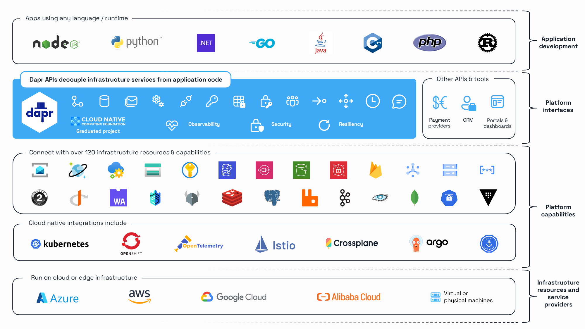

<h2>Any language, any framework, anywhere</h2>

Dapr is a portable, serverless, event-driven runtime that makes it easy for developers to build resilient, stateless and stateful microservices that run on the cloud and edge and embraces the diversity of languages and developer frameworks.

Dapr codifies the *best practices* for building microservice applications into open, independent, building blocks that enable you to build portable applications with the language and framework of your choice. Each building block is independent and you can use one, some, or all of them in your application.

We are a Cloud Native Computing Foundation (CNCF) incubation project.

## Goals

- Enable developers using *any* language or framework to write distributed applications
- Solve the hard problems developers face building microservice applications by providing best practice building blocks
- Be community driven, open and vendor neutral
- Gain new contributors
- Provide consistency and portability through open APIs
- Be platform agnostic across cloud and edge
- Embrace extensibility and provide pluggable components without vendor lock-in
- Enable IoT and edge scenarios by being highly performant and lightweight
- Be incrementally adoptable from existing code, with no runtime dependency

## How it works

Dapr injects a side-car (container or process) to each compute unit. The side-car interacts with event triggers and communicates with the compute unit via standard HTTP or gRPC protocols. This enables Dapr to support all existing and future programming languages without requiring you to import frameworks or libraries.

Dapr offers built-in state management, reliable messaging (at least once delivery), triggers and bindings through standard HTTP verbs or gRPC interfaces. This allows you to write stateless, stateful and actor-like services following the same programming paradigm. You can freely choose consistency model, threading model and message delivery patterns.

Dapr runs natively on Kubernetes, as a self hosted binary on your machine, on an IoT device, or as a container that can be injected into any system, in the cloud or on-premises.

Dapr uses pluggable component state stores and message buses such as Redis as well as gRPC to offer a wide range of communication methods, including direct dapr-to-dapr using gRPC and async Pub-Sub with guaranteed delivery and at-least-once semantics.

## Why Dapr?

Writing highly performant, scalable and reliable distributed application is hard. Dapr brings proven patterns and practices to you. It unifies event-driven and actors semantics into a simple, consistent programming model. It supports all programming languages without framework lock-in. You are not exposed to low-level primitives such as threading, concurrency control, partitioning and scaling. Instead, you can write your code by implementing a simple web server using familiar web frameworks of your choice.

Dapr is flexible in threading and state consistency models. You can leverage multi-threading if you choose to, and you can choose among different consistency models. This flexibility enables you to implement advanced scenarios without artificial constraints. Dapr is unique because you can transition seamlessly between platforms and underlying implementations without rewriting your code.

## Features

* Event-driven Pub-Sub system with pluggable providers and at-least-once semantics
* Input and output bindings with pluggable providers
* State management with pluggable data stores
* Consistent service-to-service discovery and invocation
* Opt-in stateful models: Strong/Eventual consistency, First-write/Last-write wins
* Cross platform virtual actors
* Secret management to retrieve secrets from secure key vaults
* Rate limiting
* Built-in [Observability](https://docs.dapr.io/concepts/observability-concept/) support
* Runs natively on Kubernetes using a dedicated Operator and CRDs
* Supports all programming languages via HTTP and gRPC
* Multi-Cloud, open components (bindings, pub-sub, state) from Azure, AWS, GCP
* Runs anywhere, as a process or containerized
* Lightweight (58MB binary, 4MB physical memory)
* Runs as a sidecar - removes the need for special SDKs or libraries
* Dedicated CLI - developer friendly experience with easy debugging
* Clients for Java, .NET Core, Go, Javascript, Python, Rust and C++

## Get Started using Dapr

See our [Getting Started](https://docs.dapr.io/getting-started/) guide over in our docs.

## Quickstarts and Samples

* See the [quickstarts repository](https://github.com/dapr/quickstarts) for code examples that can help you get started with Dapr.
* Explore additional samples in the Dapr [samples repository](https://github.com/dapr/samples).

## Community
We want your contributions and suggestions! One of the easiest ways to contribute is to participate in discussions on the mailing list, chat on IM or the bi-weekly community calls.
For more information on the community engagement, developer and contributing guidelines and more, head over to the [Dapr community repo](https://github.com/dapr/community#dapr-community).

### Contact Us

Reach out with any questions you may have and we'll make sure to answer them as soon as possible!

| Platform  | Link        |
|:----------|:------------|
| 💬 Instant Message Chat (preferred) | 
| 📧 Mailing List | https://groups.google.com/forum/#!forum/dapr-dev
| 🐤 Twitter | [@daprdev](https://twitter.com/daprdev)

### Community Call

Every two weeks we host a community call to showcase new features, review upcoming milestones, and engage in a Q&A. All are welcome!

📞 Visit https://aka.ms/dapr-community-call for upcoming dates and the meeting link.

### Videos and Podcasts

We have a variety of keynotes, podcasts, and presentations available to reference and learn from.

📺 Visit https://docs.dapr.io/contributing/presentations/ for previous talks and slide decks.

### Contributing to Dapr

See the [Development Guide](https://docs.dapr.io/contributing/) to get started with building and developing.

## Repositories

| Repo | Description |
|:-----|:------------|
| [Dapr](https://github.com/dapr/dapr) | The main repository that you are currently in. Contains the Dapr runtime code and overview documentation.
| [CLI](https://github.com/dapr/cli) | The Dapr CLI allows you to setup Dapr on your local dev machine or on a Kubernetes cluster, provides debugging support, launches and manages Dapr instances.
| [Docs](https://docs.dapr.io) | The documentation for Dapr.
| [Quickstarts](https://github.com/dapr/quickstarts) | This repository contains a series of simple code samples that highlight the main Dapr capabilities.
| [Samples](https://github.com/dapr/samples) | This repository holds community maintained samples for various Dapr use cases.
| [Components-contrib ](https://github.com/dapr/components-contrib) | The purpose of components contrib is to provide open, community driven reusable components for building distributed applications.
| [Dashboard ](https://github.com/dapr/dashboard) | General purpose dashboard for Dapr
| [Go-sdk](https://github.com/dapr/go-sdk) | Dapr SDK for Go
| [Java-sdk](https://github.com/dapr/java-sdk) | Dapr SDK for Java
| [JS-sdk](https://github.com/dapr/js-sdk) | Dapr SDK for JavaScript
| [Python-sdk](https://github.com/dapr/python-sdk) | Dapr SDK for Python
| [Dotnet-sdk](https://github.com/dapr/dotnet-sdk) | Dapr SDK for .NET
| [Rust-sdk](https://github.com/dapr/rust-sdk) | Dapr SDK for Rust
| [Cpp-sdk](https://github.com/dapr/cpp-sdk) | Dapr SDK for C++
| [PHP-sdk](https://github.com/dapr/php-sdk) | Dapr SDK for PHP

## Code of Conduct

Please refer to our [Dapr Community Code of Conduct](https://github.com/dapr/community/blob/master/CODE-OF-CONDUCT.md)
