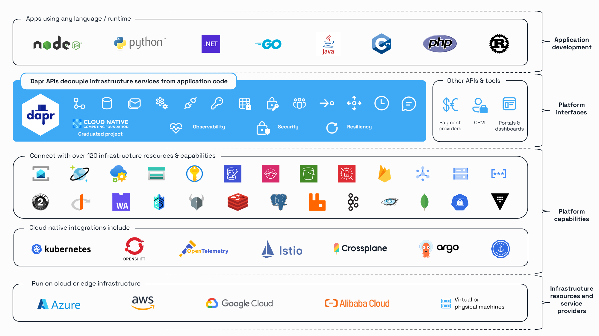

<h2>APIs for Building Secure and Reliable Microservices</h2>

[![Go Report][go-report-badge]][go-report-url] [![OpenSSF][openssf-badge]][openssf-url] [![Docker Pulls][docker-badge]][docker-url] [![Build Status][actions-badge]][actions-url] [![Test Status][e2e-badge]][e2e-url] [![Code Coverage][codecov-badge]][codecov-url] [![License: Apache 2.0][apache-badge]][apache-url] [![FOSSA Status][fossa-badge]][fossa-url] [![TODOs][todo-badge]][todo-url] [![Good First Issues][gfi-badge]][gfi-url] [![discord][discord-badge]][discord-url] [![YouTube][youtube-badge]][youtube-link] [![Bluesky][bluesky-badge]][bluesky-link] [![X/Twitter][x-badge]][x-link]

[go-report-badge]: https://goreportcard.com/badge/github.com/dapr/dapr
[go-report-url]: https://goreportcard.com/report/github.com/dapr/dapr
[openssf-badge]: https://www.bestpractices.dev/projects/5044/badge
[openssf-url]: https://www.bestpractices.dev/projects/5044
[docker-badge]: https://img.shields.io/docker/pulls/daprio/daprd?style=flat&logo=docker
[docker-url]: https://hub.docker.com/r/daprio/dapr
[apache-badge]: https://img.shields.io/github/license/dapr/dapr?style=flat&label=License&logo=github
[apache-url]: https://github.com/dapr/dapr/blob/master/LICENSE
[actions-badge]: https://github.com/dapr/dapr/workflows/dapr/badge.svg?event=push&branch=master
[actions-url]: https://github.com/dapr/dapr/actions?workflow=dapr
[e2e-badge]: https://img.shields.io/endpoint?url=https://gist.githubusercontent.com/dapr-bot/14e974e8fd6c6eab03a2475beb1d547a/raw/dapr-test-badge.json
[e2e-url]: https://github.com/dapr/dapr/actions?workflow=dapr-test&event=schedule
[codecov-badge]: https://codecov.io/gh/dapr/dapr/branch/master/graph/badge.svg
[codecov-url]: https://codecov.io/gh/dapr/dapr
[fossa-badge]: https://app.fossa.com/api/projects/custom%2B162%2Fgithub.com%2Fdapr%2Fdapr.svg?type=shield
[fossa-url]: https://app.fossa.com/projects/custom%2B162%2Fgithub.com%2Fdapr%2Fdapr?ref=badge_shield
[todo-badge]: https://badgen.net/https/api.tickgit.com/badgen/github.com/dapr/dapr
[todo-url]: https://www.tickgit.com/browse?repo=github.com/dapr/dapr
[gfi-badge]:https://img.shields.io/github/issues-search/dapr/dapr?query=type%3Aissue%20is%3Aopen%20label%3A%22good%20first%20issue%22&label=Good%20first%20issues&style=flat&logo=github
[gfi-url]:https://github.com/dapr/dapr/issues?q=is%3Aissue+is%3Aopen+label%3A%22good+first+issue%22
[discord-badge]: https://img.shields.io/discord/778680217417809931?label=Discord&style=flat&logo=discord
[discord-url]: http://bit.ly/dapr-discord
[youtube-badge]:https://img.shields.io/youtube/channel/views/UCtpSQ9BLB_3EXdWAUQYwnRA?style=flat&label=YouTube%20views&logo=youtube
[youtube-link]:https://youtube.com/@daprdev
[bluesky-badge]:https://img.shields.io/badge/Follow-%40daprdev.bsky.social-0056A1?logo=bluesky
[bluesky-link]:https://bsky.app/profile/daprdev.bsky.social
[x-badge]:https://img.shields.io/twitter/follow/daprdev?logo=x&style=flat
[x-link]:https://twitter.com/daprdev

Dapr is a set of integrated APIs with built-in best practices and patterns to build distributed applications. At its core is a **durable execution engine** — Dapr Workflow — that lets you write long-running, stateful, crash-resilient business logic as ordinary code in any language: orchestrations survive process restarts, node failures, and redeployments, and resume exactly where they left off. Around that engine, Dapr gives you the building blocks your workflows orchestrate — pub/sub, state management, service invocation, actors, secret stores, external configuration, bindings, jobs, distributed lock, and cryptography — increasing developer productivity by 20-40% without boilerplate. You benefit from the built-in security, reliability, and observability capabilities, so you don't need to write boilerplate code to achieve production-ready applications.

With Dapr, a graduated CNCF project, platform teams can configure complex setups while exposing simple interfaces to application development teams, making it easier for them to build highly scalable distributed applications. Many platform teams have adopted Dapr to provide governance and golden paths for API-based infrastructure interaction.

We are a Cloud Native Computing Foundation (CNCF) graduated project.

## Goals

- Enable developers using *any* language or framework to write distributed applications
- Solve the hard problems developers face building microservice applications by providing best practice building blocks
- Be community driven, open and vendor neutral
- Gain new contributors
- Provide consistency and portability through open APIs
- Be platform agnostic across cloud and edge
- Embrace extensibility and provide pluggable components without vendor lock-in
- Enable IoT and edge scenarios by being highly performant and lightweight
- Be incrementally adoptable from existing code, with no runtime dependency

## How it works

Dapr injects a side-car (container or process) to each compute unit. The side-car interacts with event triggers and communicates with the compute unit via standard HTTP or gRPC protocols. This enables Dapr to support all existing and future programming languages without requiring you to import frameworks or libraries.

Dapr offers built-in state management, reliable messaging (at least once delivery), triggers and bindings through standard HTTP verbs or gRPC interfaces. This allows you to write stateless, stateful and actor-like services following the same programming paradigm. You can freely choose consistency model, threading model and message delivery patterns.

Dapr runs natively on Kubernetes, as a self hosted binary on your machine, on an IoT device, or as a container that can be injected into any system, in the cloud or on-premises.

Dapr uses pluggable component state stores and message buses such as Redis as well as gRPC to offer a wide range of communication methods, including direct dapr-to-dapr using gRPC and async Pub-Sub with guaranteed delivery and at-least-once semantics.

Dapr also runs a durable workflow engine in the sidecar: orchestration code you write is checkpointed automatically and resumes after failures, so long-running business processes survive crashes and restarts without custom recovery logic.

## Why Dapr?

Writing highly performant, scalable and reliable distributed application is hard. Dapr brings proven patterns and practices to you. It unifies event-driven and actors semantics into a simple, consistent programming model. It supports all programming languages without framework lock-in. You are not exposed to low-level primitives such as threading, concurrency control, partitioning and scaling. Instead, you can write your code by implementing a simple web server using familiar web frameworks of your choice.

Dapr is flexible in threading and state consistency models. You can leverage multi-threading if you choose to, and you can choose among different consistency models. This flexibility enables you to implement advanced scenarios without artificial constraints. Dapr is unique because you can transition seamlessly between platforms and underlying implementations without rewriting your code.

## Dapr Workflow — durable execution as code

Dapr Workflow is a **durable execution engine**: you write orchestration logic as plain code, and Dapr guarantees it runs to completion exactly once, even across crashes, restarts, and rescheduling. State and progress are persisted automatically — there are no queues, sagas, or state machines to hand-build.

Workflows compose the rest of Dapr: an activity can invoke a service, publish an event, read or write state, call an actor, or schedule a job — all with Dapr's built-in reliability, security, and observability. Common [workflow patterns](https://docs.dapr.io/developing-applications/building-blocks/workflow/workflow-patterns/) include task chaining, fan-out/fan-in, monitors, external-event / human-in-the-loop approval gates, and child workflows — including **multi-application workflows** that orchestrate activities and child workflows across different services.

Workflow authoring is **stable** in the .NET, Java, Python, Go, and JavaScript SDKs.

▶ [Workflow overview](https://docs.dapr.io/developing-applications/building-blocks/workflow/workflow-overview/) · [Quickstart](https://docs.dapr.io/getting-started/quickstarts/workflow-quickstart/) · [Patterns](https://docs.dapr.io/developing-applications/building-blocks/workflow/workflow-patterns/)

### Recent workflow milestones

| Release | Workflow highlights |
|:--|:--|
| **1.15** | Workflow API declared **stable**; the workflow engine was rewritten for performance and scale, with dynamic scaling from 0 to many replicas while staying durable. Actor runtime rewritten (workflows run on actors). Scheduler service stable. |
| **1.16** | **Multi-application workflows** — a workflow can call activities and start child workflows in other applications, durably. Major throughput and stability improvements for high-concurrency workloads. Compensation (saga) pattern in the Java SDK. |
| **1.17** | **Workflow versioning** (named versions and patching) to safely evolve long-running workflows without breaking in-flight instances. History retention policies, end-to-end tracing, and `dapr workflow` CLI management commands (list / history / suspend / resume / terminate / rerun / raise-event / purge). |
| **1.18** | Security and scale: `WorkflowAccessPolicy` (control which apps may invoke which workflows and activities), cryptographic workflow-history tamper detection with cross-app attestation, workflow-history context propagation to children, scheduler-level concurrency limits, external-event timers for human-in-the-loop gates, and the new `MCPServer` resource that exposes MCP tool calls as durable workflows. |

See the [release notes](https://github.com/dapr/dapr/releases) for full details.

## Features

* **Durable workflow engine** — author long-running, fault-tolerant orchestrations as code (stable since v1.15): task chaining, fan-out/fan-in, child workflows, human-in-the-loop / external events, workflow versioning, and multi-application workflows that span services
* Event-driven Pub-Sub system with pluggable providers and at-least-once semantics
* Input and output bindings with pluggable providers
* State management with pluggable data stores
* Consistent service-to-service discovery and invocation
* Opt-in stateful models: Strong/Eventual consistency, First-write/Last-write wins
* Cross platform virtual actors
* Secret management to retrieve secrets from secure key vaults
* Rate limiting
* Built-in [Observability](https://docs.dapr.io/concepts/observability-concept/) support
* Runs natively on Kubernetes using a dedicated Operator and CRDs
* Supports all programming languages via HTTP and gRPC
* Multi-Cloud, open components (bindings, pub-sub, state) from Azure, AWS, GCP
* Runs anywhere, as a process or containerized
* Lightweight (58MB binary, 4MB physical memory)
* Runs as a sidecar - removes the need for special SDKs or libraries
* Dedicated CLI - developer friendly experience with easy debugging
* Clients for Java, .NET Core, Go, Javascript, Python, Rust and C++

## Get Started using Dapr

See our [Getting Started](https://docs.dapr.io/getting-started/) guide over in our docs.

## Quickstarts and Samples

* See the [quickstarts repository](https://github.com/dapr/quickstarts) for code examples that can help you get started with Dapr.
* Explore additional samples in the Dapr [samples repository](https://github.com/dapr/samples).

## Community
We want your contributions and suggestions! One of the easiest ways to contribute is to participate in discussions on the mailing list, chat on IM or the bi-weekly community calls.
For more information on the community engagement, developer and contributing guidelines and more, head over to the [Dapr community repo](https://github.com/dapr/community#dapr-community).

### Contact Us

Reach out with any questions you may have and we'll make sure to answer them as soon as possible!

| Platform  | Link        |
|:----------|:------------|
| 💬 Discord (preferred) | 
| 💭 LinkedIn | [@daprdev](https://www.linkedin.com/company/daprdev)
| 🦋 BlueSky | [@daprdev.bsky.social](https://bsky.app/profile/daprdev.bsky.social)
| 🐤 Twitter | [@daprdev](https://twitter.com/daprdev)

### Community Call

Every two weeks we host a community call to showcase new features, review upcoming milestones, and engage in a Q&A. All are welcome!

📞 Visit [Upcoming Dapr Community Calls](https://github.com/dapr/community/issues?q=is%3Aissue%20state%3Aopen%20label%3A%22community%20call%22) for upcoming dates and the meeting link.

📺 Visit https://www.youtube.com/@DaprDev/streams for previous community call live streams.

### Videos and Podcasts

We have a variety of keynotes, podcasts, and presentations available to reference and learn from.

📺 Visit https://docs.dapr.io/contributing/presentations/ for previous talks and slide decks or our YouTube channel https://www.youtube.com/@DaprDev/videos.

### Contributing to Dapr

See the [Development Guide](https://docs.dapr.io/contributing/) to get started with building and developing.

## Repositories

| Repo | Description |
|:-----|:------------|
| [Dapr](https://github.com/dapr/dapr) | The main repository that you are currently in. Contains the Dapr runtime code and overview documentation.
| [CLI](https://github.com/dapr/cli) | The Dapr CLI allows you to setup Dapr on your local dev machine or on a Kubernetes cluster, provides debugging support, launches and manages Dapr instances.
| [Docs](https://docs.dapr.io) | The documentation for Dapr.
| [Quickstarts](https://github.com/dapr/quickstarts) | This repository contains a series of simple code samples that highlight the main Dapr capabilities.
| [Samples](https://github.com/dapr/samples) | This repository holds community maintained samples for various Dapr use cases.
| [Components-contrib ](https://github.com/dapr/components-contrib) | The purpose of components contrib is to provide open, community driven reusable components for building distributed applications.
| [Go-sdk](https://github.com/dapr/go-sdk) | Dapr SDK for Go
| [Java-sdk](https://github.com/dapr/java-sdk) | Dapr SDK for Java
| [JS-sdk](https://github.com/dapr/js-sdk) | Dapr SDK for JavaScript
| [Python-sdk](https://github.com/dapr/python-sdk) | Dapr SDK for Python
| [Dotnet-sdk](https://github.com/dapr/dotnet-sdk) | Dapr SDK for .NET
| [Rust-sdk](https://github.com/dapr/rust-sdk) | Dapr SDK for Rust
| [Cpp-sdk](https://github.com/dapr/cpp-sdk) | Dapr SDK for C++
| [PHP-sdk](https://github.com/dapr/php-sdk) | Dapr SDK for PHP

## Code of Conduct

Please refer to our [Dapr Community Code of Conduct](https://github.com/dapr/community/blob/master/CODE-OF-CONDUCT.md)
