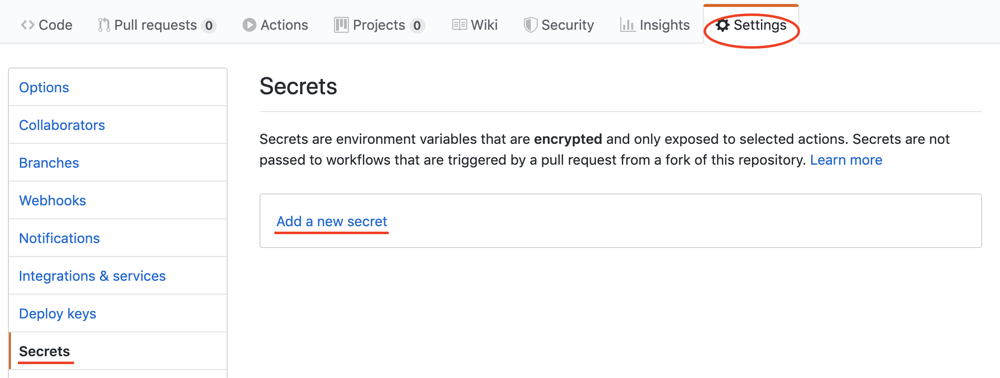
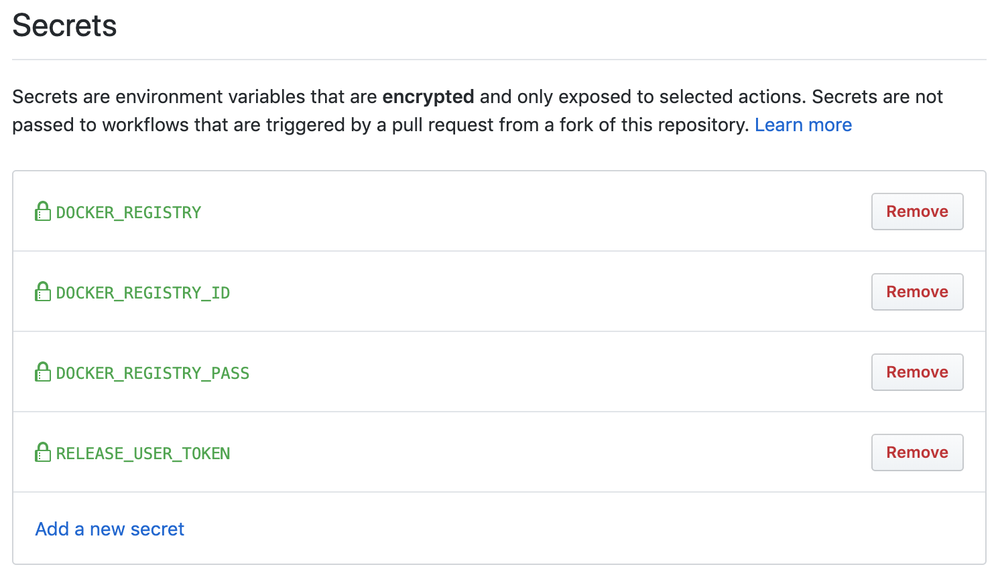
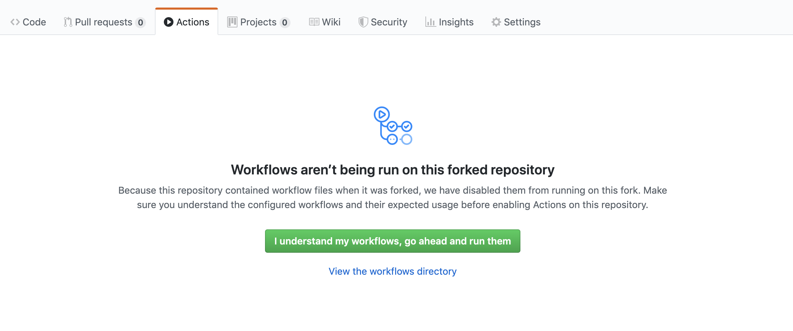
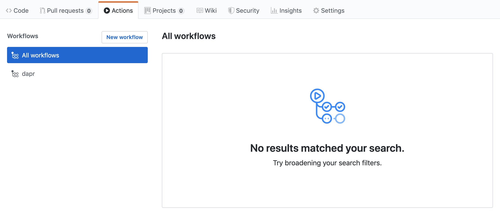

# Setup Continuous Integration

Dapr uses [GitHub Actions](https://github.com/features/actions) for continuous integration in order to automate build and publish process. As long as you have GitHub Account, you can set up your own private actions in your personal account. This document helps you set up the continuous integration for Dapr.

## Prerequistes

* GitHub Account

## How to set up GitHub Actions in your account

1. Fork [dapr repo](https://github.com/dapr/dapr) to your GitHub Account

2. Go to `Settings` in the forked repo and click Secrets

3. Add secret variables for Dapr CI

* DOCKER_REGISTRY : Your private docker registry name or dockerhub id e.g. docker.io/[your_dockerhub_id]
* DOCKER_REGISTRY_ID : Your private docker registry id
* DOCKER_REGISTRY_PASS : Your private docker registry password or dockerhub password/token
* DAPR_BOT_TOKEN : Your [GitHub Personal Access Token](https://help.github.com/en/github/authenticating-to-github/creating-a-personal-access-token-for-the-command-line) - You do not need this unless you want to publish binaries to your forked GitHub release.

4. Go to `Actions` tab

Click `I understand my workflows, go ahead and run them`

5. Make sure your Actions is enabled

## Trigger the build

Dapr CI has the four different behaviors based on the situations:

|  | Build binaries | Store binaries into artifact | Publish docker image | GitHub Release |
|-----|--------------|------------------------------|-------------------|--------------|
| Create PR against master branch | X | X | | |
| Push the commit to master branch | X | X | `dapr:edge` image | |
| Push vX.Y.Z-rc.R tag e.g. v0.0.1-rc.0 | X | X | `dapr:vX.Y.Z-rc.R` image | X |
| Push vX.Y.Z tag e.g. v0.0.1 | X | X | `dapr:vX.Y.Z` and `dapr:vX.Y.Z:latest` image | X |
