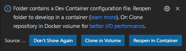

# Setup Dapr development environment using Visual Studio Code

This document helps you get started developing Dapr using VSCode. If you find any problems while following this guide, please create a Pull Request to update this document.

## Using a development container in Visual Studio Code (VSCode)

[VSCode](https://code.visualstudio.com/) supports development in a containerized environment through its [Remote - Container extension](https://code.visualstudio.com/docs/remote/containers), so you don't need to manually install all of the tools and frameworks needed to [setup a dapr development environment](./setup-dapr-development-env.md) yourself.

### Prerequisites

1. [Docker](https://docs.docker.com/get-docker/)
   > For Windows users, we recommend enabling [WSL2 back-end integration with Docker](https://docs.docker.com/docker-for-windows/wsl/).
2. [Visual Studio Code](https://code.visualstudio.com/)
3. [Visual Studio Code Remote - Containers extension](https://marketplace.visualstudio.com/items?itemName=ms-vscode-remote.remote-containers)

### Using the Dapr development container

1. After you have cloned the dapr repo locally, open the dapr folder in VSCode. For example:

   ```bash
   git clone https://github.com/dapr/dapr.git
   cd dapr
   code .
   ```

   VSCode will detect the presence of a dev container definition in the repo and will prompt you to reopen the project in a container:

   

   Alternatively, you can open the command palette and use the `Remote-Containers: Reopen in Container` command.

2. Once the container is loaded, open an [integrated terminal](https://code.visualstudio.com/docs/editor/integrated-terminal) in VSCode and you're ready to start [Developing Dapr](./developing-dapr.md)!

## Customizing your dev container

The Dapr dev container is configured by default to support [GitHub Codespaces](https://github.com/features/codespaces), which you might want to change when running the dev container locally on your device.

### Personalizing user settings in a dev container

VSCode supports applying your user settings, such as your `.gitconfig`, to a dev container through the use of [dotfiles repositories](https://code.visualstudio.com/docs/remote/containers#_personalizing-with-dotfile-repositories). This can be done through your own VSCode `settings.json` file without changing the dev container image or configuration.
### Using a custom dev container image

The Dapr [devcontainer.json](../../.devcontainer/devcontainer.json) uses the latest image from the [daprio dockerhub](https://hub.docker.com/r/daprio/dapr-dev), but you may need to modify the image destination to suit your host environment. For example, if you are using the devcontainer on a Linux host with a user whose UID is not 1000, you many need to remap the UID of the `dapr` user in the dev container to match your UID on the host.

1. Edit the [docker/Dockerfile-dev](../../docker/Dockerfile-dev) container image definition.
2. Replace the `"image"` property with the commented-out `"dockerFile"` property in [devcontainer.json](../../.devcontainer/devcontainer.json) to build and use the updated `Dockerfile-dev` file.

   ```json
   {
     "name": "Dapr Dev Environment",
     // Update container version when you update dev-container
     // "image": "docker.io/daprio/dapr-dev:0.1.3",
     // Replace with uncommented line below to build your own local copy of the image
     "dockerFile": "../docker/Dockerfile-dev",
     "runArgs": [
   ...
   ```

3. Rebuild and reopen the workspace in the dev container via the command palette and the `Remote-Containers: Rebuild and Reopen in Container` command.

4. When you are satisfied with your changes, you can optionally publish your container image to your own registry to speed up rebuilding the container when you only want to make changes to the `devcontainer.json` configuration in the future. For a Docker registry named `myregistry`:

   ```bash
   export DAPR_REGISTRY=myregistry
   make build-dev-container
   make push-dev-container
   ```

   And the `devcontainer.json` would be updated to restore the `"image"` property pointing to your own image:

   ```json
   {
     "name": "Dapr Dev Environment",
     // Update container version when you update dev-container
     "image": "docker.io/myregistry/dapr-dev:0.1.3",
     // Replace with uncommented line below to build your own local copy of the image
     // "dockerFile": "../docker/Dockerfile-dev",
     "runArgs": [
   ...
   ```

### Sharing a Docker environment with localhost

The default Dapr dev container provides a Docker-in-docker configuration, so containers set up inside the dev container are not visible to the host and vice versa. This prevents the host environment from interfering with the dev container environment, for example, so that both the host and dev container can have separate standalone Dapr environments via `dapr init`.

If there are situations where you would like the dev container to share the Docker environment of the host or between multiple dev containers, you will likely want your dev container to be on the same network as your localhost, so you will need to update the `"runArgs"` property list to include the `"--net=host"` setting in `devcontainer.json`:

```json
"runArgs": [
  ...

  // Uncomment to bind to host network for local devcontainer; this is necessary if using the
  // bind-mounted /var/run/docker-host.sock directly.
  "--net=host",
```

In addition, there are a couple of options for how you can expose the localhost Docker context to the dev container:

#### Create a Docker context for localhost in the dev container

The default `devcontainer.json` already maps a socket for the localhost Docker into the dev container, so you can take advantage of that by defining a Docker separate context for using it in the dev container:

> ⚠ If your localhost is a Linux system, note that the dev container is running as `--privileged` and these instructions can modify your privileges.

 ```bash
 sudo chown root:docker /var/run/docker-host.sock
 docker context create host-context --description "Use localhost Docker environment" --docker "host=unix:///var/run/docker-host.sock"
 docker context use host-context
 docker ps
 ```

 You should be able to see that the dev container itself is now visible in the list of running containers in the host-context. You can also use `docker context use default` to toggle back to using the Docker-in-docker configuration.

#### Rebind /var/run/docker.sock to localhost

If you don't want to use the Docker-in-docker configuration at all, you can chose to rebind the `/var/run/docker.sock` directly to the localhost socket so that the default Docker context is always the localhost. This can be done by enabling the `BIND_LOCALHOST_DOCKER` environment variable in the `devcontainer.json` file:

```json
"containerEnv": {
  ...
  // Uncomment to disable docker-in-docker and automatically proxy default /var/run/docker.sock to
  // the localhost bind-mount /var/run/docker-host.sock.
  "BIND_LOCALHOST_DOCKER": "true"
},
```

This approach has the added benefit that it will use socat to proxy `/var/run/docker-host.sock` if it is owned by root on localhost, to avoid modifying localhost permissions on Linux hosts.
### Cloning your Kubernetes configuration into the dev container

Since it is likely that contributors and maintainers will want to test Dapr changes against a Kubernetes environment, the Dapr dev container comes pre-installed with Kubernetes, Helm and Minikube for testing within the dev container environment.

If you want to reuse an existing Kubernetes config, such as your [Azure Kubernetes Service config](https://docs.dapr.io/operations/hosting/kubernetes/cluster/setup-aks/) or local [Minikube cluster](https://docs.dapr.io/operations/hosting/kubernetes/cluster/setup-minikube/), you can also configure the `devcontainer.json` copy those settings into the dev container as well. This requires:

1. Enabling the `SYNC_LOCALHOST_KUBECONFIG` environment variable
2. Bind mounting the locations of your Kubernetes and Minikube config paths to `/home/dapr/.kube-localhost` and `/home/dapr/.minikube-localhost` respectively.
   - You don't need to bind the Minikube path if you're not using it.

```json
"containerEnv": {
  // Uncomment to overwrite devcontainer .kube/config and .minikube certs with the localhost versions
  // each time the devcontainer starts, if the respective .kube-localhost/config and .minikube-localhost
  // folders respectively are bind mounted to the devcontainer.
  "SYNC_LOCALHOST_KUBECONFIG": "true",
  ...
},

...

"runArgs": [
  ...
  // Uncomment to clone local .kube/config into devcontainer
  "--mount", "type=bind,source=${env:HOME}${env:USERPROFILE}/.kube,target=/home/dapr/.kube-localhost",

  // Uncomment to additionally clone minikube certs into devcontainer for use with .kube/config
  "--mount", "type=bind,source=${env:HOME}${env:USERPROFILE}/.minikube,target=/home/dapr/.minikube-localhost",
  ...
]
```

The `SYNC_LOCALHOST_KUBECONFIG` option only supports providing the dev container with the snapshot configuration from the host and does not support updating the host Kubernetes configuration from the dev container directly.

- The copy happens on every boot of the dev container, so any changes on the host side are not captured after the dev container is started.
- Any changes made to the dev container `~/.kube/config` such as changing the default context or updating credentials are not reflected back to the host, even if it may have changed for the underlying environment (e.g. AKS credential updates).
- If using Minikube, it needs to be started on the host before the dev container is launched. The Minikube configuration in the dev container is distinct from the host and cannot be used to start the host Minikube from inside the dev container. This option only supports cloning default Minikube credentials into the dev container for use by the Kubernetes config.
- The copy will overwrite any previous state in the dev container with localhost settings, so do not use this option with the dev container's instance of Minikube.
