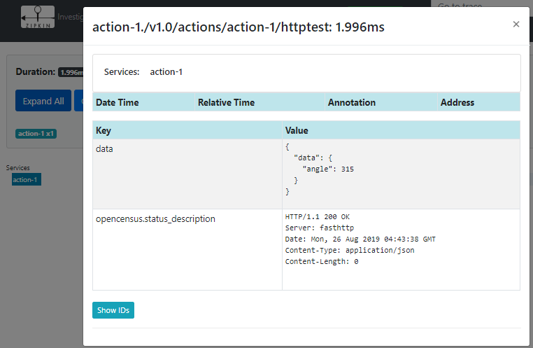

# Distributed Tracing

Actions uses [OpenCensus](https://opencensus.io/) for distributed tracing. This tutorial shows you how to configure distributed tracing to export call traces to [Zipkin](https://zipkin.io/). For more details on configuring exporters to other tracing backends such as [Azure Monitor](https://azure.microsoft.com/en-us/services/monitor/), [Prometheus](https://prometheus.io/) and [AWS X-Ray](https://aws.amazon.com/xray/), please see OpenCensus's [exporters page](https://opencensus.io/exporters/).

## Prerequisites
1. Java runtime or Docker (for running Zipkin)
2. Latest Action CLI 
3. Go (for running the test app)
## Set up Zipkin
You can run Zipkin either as a Docker container or a Java package.
### Run with Docker
```
docker run -d -p 9411:9411 openzipkin/zipkin
```
### Run with Java
1. Download Zipkin:
```bash
curl -sSL https://zipkin.io/quickstart.sh | bash -s
```
2. Start Zipkin
```bash
java -jar zipkin.jar
```
3. Verify Zipkin is working by visiting its Web UI at: http://localhost:9411

## Create the configuration file
To configure distributed tracing for Actions, you need to create an Actions configuration file, which contains the tracing specification. Create a file named actions_config.yaml with the following content:

```yaml
spec:
  tracing:
    enabled: true
    exporterType: zipkin
    exporterAddress: "http://localhost:9411/api/v2/spans"
    expandParams: true
    includeBody: true
```

> NOTE: You can find the file under the [samples/distributed-tracing](../samples/distributed-tracing/actions_config.yaml) folder.
## Run sample scenarios

The best way to test out distributed tracing is to use samples in this repository. Please follow the instructions in corresponding sample folders with one exception: when you run *actions* command, you need to supply an additional _config_ switch pointing to the configuration file.

### From Zero to Hero Locally

When launching the Node application, use:
```bash
actions run --app-id mynode --app-port 3000 --config ../distributed-tracing/actions_cofig.yaml node app.js
```

## Observe the traces

To observe traces in any sample scenarios, navigate to the Zipkin UI (http://localhost:9411):

 

