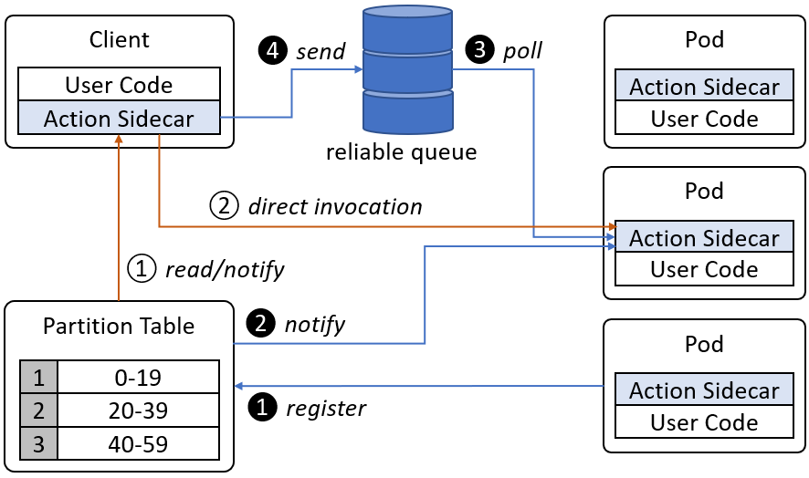
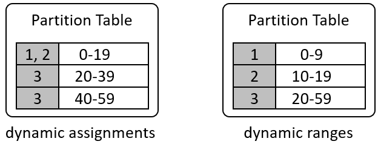

# Enabling the Actor Pattern
The Actor Pattern has been broadly used in modeling complex distributed systems in which a large number of individual agents work together. For example, in many IoT solutions, actors are often used as digital presences of physical devices. Actions supports the Actor Pattern by offering key characteristics of an actor. This document introduces architecturally how Actions enables the Actor Pattern. To learn about how to use the Actor Pattern with Actions, please read [this document](../concepts/actor/actor_pattern.md).

## Overview
Actions uses an off-path **partition table** to assign actor ids to service instances so that requests to the same actor id is always routed to the same instance. The partition table is dynamically adjusted when re-partitioning or failover happens. Changes to the table are broadcasted to Actions sidecars to update their own settings to match with the global table. 

A client can talk to an actor through either reliable messaging or direct invocation, as illustrated by the following diagram:

### Calling an actor through messaging
1. When a process pair of user code and Actions sidecar comes up, the sidecar registers the pair (such as a Pod on Kubernetes) with a **partition table** hosted on the Actions control plane.
2. The partition table updates itself to reflect the topology change. 
Then, it broadcasts a change notification to all Actions sidecars.
3. The Actions sidecar updates its own settings to poll messages from corresponding partitions of a reliable queue.
4. The client code sends requests to the reliable queue, which puts the requests in corresponding partitions based on the associated contextual ids. Then, the messages are picked up and consumed during the next poll.

### Calling an actor through direct invocation
1. The client sidecar reads the partition table to find actor id assignments.
2. The sidecar figures out a direct route to the target service instance and sends the request direct to the destination sidecar.

## Messaging

When enabled, each Actions sidecar has a designated reliable message queue. This allows the sidecar to sequentialize requests to a specific actor id. Actions supports at-least-once delivery and exact-once delivery within a configurable time window. Please see [reliable messaging](TBD) for more details.

Reliable messing is not used for direct invocations. In such a case, user code is expected to handle response errors and retry the request as needed.

## State Management

All state access are encapsulated in a **state provider**. Actions expects a state provider to offer state partitioning for scale and replication for high availability and reliability. 

Because all requests to an actor instance are routed to the same Actions service instance, the user code can use local variables as local caches of its state.

When Actions routes an actor instance to a new Actions service instance, it invokes the **/state** endpoint so that the actor instance can restore state from the state store.

## Partition Table

Actions uses different strategies to mange and use the partition table for different scenarios. Although partition table doesn’t sit on active data path, Actions tries to employ any possible optimizations to minimize the overheads of table management and lookups.

### Skipping the table

If an Actions service is stateless, and if only direct invocation is needed, the partition table is skipped. In this case, requests to actor instances are distributed by the service load balancer.

If an Actions service is stateless, and is known to have light traffic so that messaging system partition is not needed, the table can also be skipped even when reliable messaging is used, because all Actions instances will simply compete for the latest messages from the same partition.

If Actions services have stable identifiers (i.e. doesn’t change when restarted or relocated), and both the possible range of actor Ids and all Actions service ids are known, a predefined algorithm can be used to decide actor partitions instead of looking up the partition table. However, in such a case, dynamic partitioning is not allowed.

### Range-only table

Range-only table contains rows of actor id ranges only. When the service replica number changes, the table is updated so that the possible range is evenly distributed across all service replicas.

The partition table can change its assignments based on partition loads. For example, when it finds the first partition is heavily used than others, it can reassign multiple service instances to the partition through **dynamic assignments**, or re-partition through **dynamic ranges**, as shown by the following diagram:

Dynamic assignments requires less sidecar configuration changes, but it requires a sidecar being able to handle multiple partitions. 

### Per-actor table

Per-actor table maintains a detailed mapping between actor ids and service instances. Per-actor table is quite expensive to maintain. It’s most useful when the actor code fluctuates in resource consumption when given different workloads. In such case, a more sophisticated scheduling algorithm, such as a greedy algorithm or a dynamic programming algorithm, can be used to place the actor instances. 

In addition to the increased maintenance burden, per-actor table also triggers sidecar configuration updates much more frequently. And the sidecar needs to be able to handle scattered id ranges, when could be hard to be implemented against certain messaging systems.

In the above discussion, it's been assumed that service instances have stable identifiers. If this is not the case, a check-in-check-out mechanism is needed for a service instance to associate itself to a given partition. In such as case, the partition table defines partition ranges but doesn’t define assignments. Instead, all sidecars come in as competing consumers and attempt to check out partitions. A partition can be explicitly checked in for scenarios such controlled upgrades. Otherwise, a checkout expires after certain time window and the partition is made available for checkouts again.

## Sequential Access

When configured to run as actors, Actions sidecar dispatches messages to user code. The user code is free to use whatever threading model of choice to handle these messages. When the user code tries to preserve state, the state write requests are again dispatched to the underlying state store sequentially.

Actions allows read-only requests (signified by the GET verb) to be routed to any service instances. This allows the single-writer-multiple-reader pattern, in which readers get eventual consistent (but almost always up-to-date - the delta is the single in-flight transaction) reads on actor states.

Such sequential access pattern is broken when multiple activations occur. For example, due to network partition, two service instances get different partition table data and try to poll data from the same partition. One message for an actor goes to intance A and the subsquent message for the same actor goes to instance B. This may lead to consistency issues. 

One way to partially mitigate this is to add a auto-increment version tag on state data so that the user code can check for conflicting updates while submitting its changes. 

## Summary

Actions can be used as building blocks to build a complete Actor framework but itself isn’t one. As a developer, you should be aware that when you use Actions by itself, you can configure it to offer some characteristics of an Actor, but you should not assume it gives a complete feature set as a complete Actor framework.