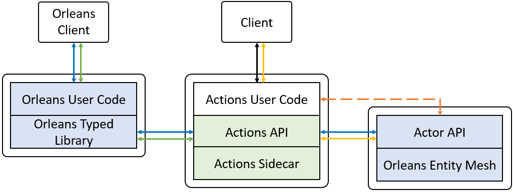

# Integration with Orleans

[Orleans](https://github.com/dotnet/orleans) is a framework for building distributed high-scale applications. It implements the [Virtual Actors model](https://www.microsoft.com/en-us/research/publication/orleans-distributed-virtual-actors-for-programmability-and-scalability/?from=https%3A%2F%2Fresearch.microsoft.com%2Fapps%2Fpubs%2Fdefault.aspx%3Fid%3D210931) for cloud applications. The Actions team has been collaborating with the Orleans team to bring the two together. The integration brings benefits to both Orleans developers and Actions developers:

* Developers can use strongly typed Orleans programming models on top of Actions runtime. And with the separation of programming experience and runtime, Orleans is poised for supporting more programming languages.
* Developers can easily orchestrate Orleans services with other service such as containerized services, managed cloud services and functions to form comprehensive applications.
* Developers can leverage Orleans runtime features using the standard Actions API without writing Orleans-specific code.

## Overview
To enable this integration, Orleans binary is split into two parts: a **typed library** to deliver developer experience, and a **runtime library** that operates the Orleans entity mesh. The Orleans typed library interacts with Actions RPC (HTTP or gRPC) API to integrate with Actions system. 

Actions defines an **Actor API** that encapsulates Actions' interaction with an Actor Framework. In this case, Actions RPC API talks to an Orleans Actor API implementation that allows Actions to invoke Orleans’ native entities.

The overall archiecture is illustrated by the following diagram:

The architecture supports multiple integration paths:

* Blue route: End-to-end Orleans experience with full-featured Orleans SDK and runtime. Users can then configure integration with other services such as Functions and Logic Apps through Actions.

* Green route: Orleans programming experience on top of Actions. 

* Yellow route: Actions code taking advantage of Orleans runtime.

* Dotted route: If the developer chose to, she can directly call Orleans Actor API from her Actions code as well. This saves a hop through Actions.
