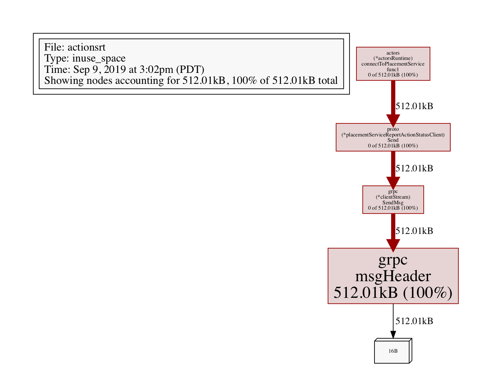
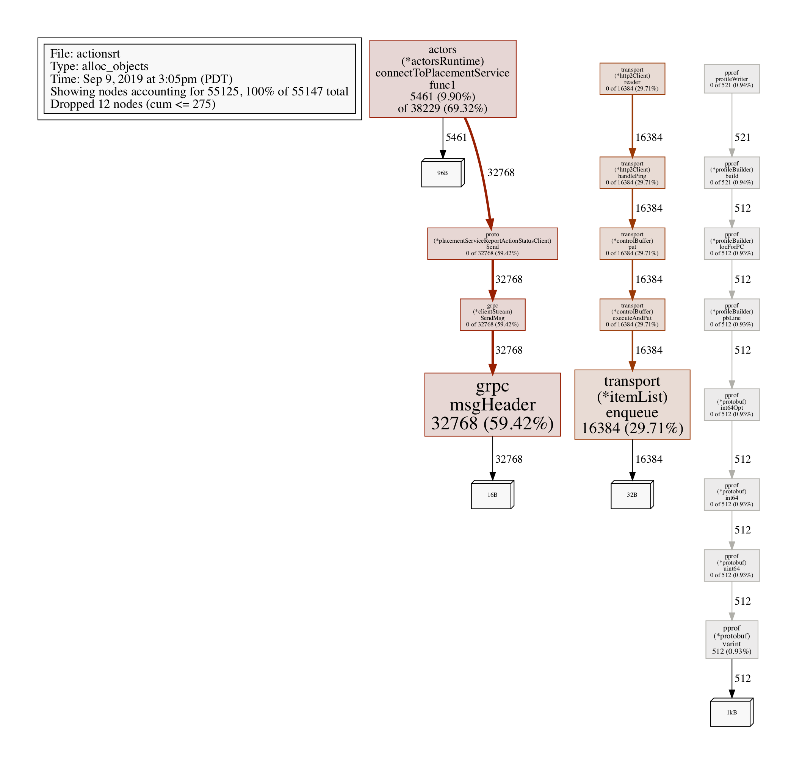

# Profiling and Debugging

In any real world scenario, an app might start exhibiting undesirable behavior in terms of resource spikes.
CPU/Memory spikes are not uncommon in most cases.

Actions allows users to start an on-demand profiling session using `pprof` through its profiling server endpoint and start an instrumentation session to discover problems and issues such as concurrency, performance, cpu and memory usage.

## Enable profiling

Actions allows you to enable profiling in both Kubernetes and Standalone modes.

### Kubernetes

To enable profiling in Kubernetes, simply add the following annotation to your Actions annotated pod:

<pre>
annotations:
    actions.io/enabled: "true"
    actions.io/id: "rust-app"
    <b>actions.io/profiling: "true"</b>
</pre>

### Standalone

To enable profiling in Standalone mode, pass the `enable-profiling` and the `profile-port` flags to the Actions CLI:
Note that `profile-port` is not required, and Actions will pick an available port.

`actions run --enable-profiling true --profile-port 7777 python myapp.py`

## Debug a profiling session

After profiloing is enabled, we can start a profiling session to investigate what's going on with the Actions runtime.

### Kubernetes

First, find the pod containing the Actions runtime. If you don't already know the the pod name, type `kubectl get pods`:

```
NAME                                        READY     STATUS    RESTARTS   AGE
divideapp-6dddf7dc74-6sq4l                  2/2       Running   0          2d23h
```

If profiling has been enabled successfully, the runtime logs should show the following:
`time="2019-09-09T20:56:21Z" level=info msg="starting profiling server on port 7777"`

In this case, we want to start a session with the Actions runtime inside of pod `divideapp-6dddf7dc74-6sq4l`.

We can do so by connecting to the pod via port forwarding:

```
kubectl port-forward divideapp-6dddf7dc74-6sq4 7777:7777
Forwarding from 127.0.0.1:7777 -> 7777
Forwarding from [::1]:7777 -> 7777
Handling connection for 7777
```

Now that the connection has been established, we can use `pprof` to profile the Actions runtime.

The following example will create a `cpu.pprof` file containing samples from a profile session that lasts 120 seconds:
`curl "http://localhost:7777/debug/pprof/profile?seconds=120" > cpu.pprof`

Analyze the file with pprof:

```
pprof cpu.pprof
```

You can also save the results in a visualized way inside a PDF:

`go tool pprof --pdf your-binary-file http://localhost:7777/debug/pprof/profile?seconds=120 > profile.pdf`

For memory related issues, you can profile the heap:

`go tool pprof --pdf your-binary-file http://localhost:7777/debug/pprof/heap > heap.pdf`



Profiling allocated objects:

```
go tool pprof http://localhost:7777/debug/pprof/heap
> exit

Saved profile in /Users/myusername/pprof/pprof.actionsrt.alloc_objects.alloc_space.inuse_objects.inuse_space.003.pb.gz
```

To analyze, grab the file path above (its a dynamic file path, so pay attention to note paste this one), and execute:

`go tool pprof -alloc_objects --pdf /Users/myusername/pprof/pprof.actionsrt.alloc_objects.alloc_space.inuse_objects.inuse_space.003.pb.gz > alloc-objects.pdf`




### Standalone

For Standalone mode, locate the Actions instance that you want to profile:

```
actions list
APP ID           ACTIONS PORT  APP PORT  COMMAND      AGE  CREATED              PID
node-subscriber  3500          3000      node app.js  12s  2019-09-09 15:11.24  896
```

Grab the ACTIONS PORT, and if profiling has been enabled as desribed above, you can now start using `pprof` to profile Actions.
Look at the Kubernetes examples above for some useful commands to profile Actions.

More info on pprof can be found [here](https://github.com/google/pprof).
