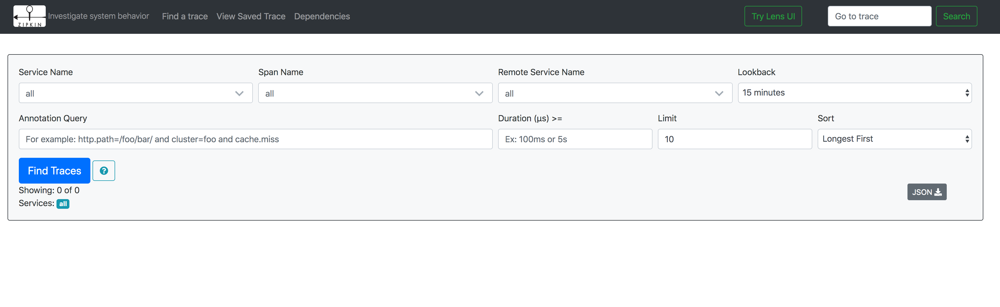

# Tracing

Actions integrates seamlessly with Open Census for telemtry and tracing.
Visit our [Distributed Tracing](../distributed_tracing.md) section for more info.

It is recommended to run Actions with tracing enabled for any production scenario.
Since Actions uses Open Census, you can configure various exporters for tracing and telemtry data based on your environment, whether it is running in the cloud or on-premises.

## Distributed Tracing with Zipkin on Kubernetes

The following steps will show you how to configure Actions to send distributed tracing data to Zipkin running as a container in your Kubernetes cluster, and how to view them.


### Setup

First, deploy Zipkin:

```
kubectl run zipkin --image openzipkin/zipkin --port 9411
```

Create a Kubernetes Service for the Zipkin pod:

```
kubectl expose deploy zipkin --type ClusterIP --port 9411
```

Next, create the following YAML file locally:

```
apiVersion: actions.io/v1alpha1
kind: Configuration
metadata:
  name: zipkin
spec:
  tracing:
    enabled: true
    exporterType: zipkin
    exporterAddress: "http://zipkin.default.svc.cluster.local:9411/api/v2/spans"
    expandParams: true
    includeBody: true
```

Finally, deploy the Actions configuration:

```
kubectl apply -f config.yaml
```

In order to enable this configuration for your Actions sidecar, add the following annotation to your pod spec template:

```
annotations:
  actions.io/config: "zipkin"
```

That's it! your sidecar is now configured for use with Open Census and Zipkin.

### Viewing Tracing Data

To view traces, connect to the Zipkin Service and open the UI:

```
kubectl port-forward svc/zipkin 9411:9411
```

On your browser, go to ```http://localhost:9411``` and you should see the Zipkin UI.



## Distributed Tracing with Zipkin - Standalone Mode

For standalone mode, create an Actions Configuration CRD file locally and reference it with the Actions CLI.

1. Create the following YAML file:

```
apiVersion: actions.io/v1alpha1
kind: Configuration
metadata:
  name: zipkin
spec:
  tracing:
    enabled: true
    exporterType: zipkin
    exporterAddress: "http://localhost:9411/api/v2/spans"
    expandParams: true
    includeBody: true
```

2. Launch Zipkin using Docker:

```
docker run -d -p 9411:9411 openzipkin/zipkin
```

3. Launch Actions with the `--config` param:

```
actions run --app-id mynode --app-port 3000 --config ./cofig.yaml node app.js
```

## Tracing Configuration

The `tracing` section under the `Configuration` spec contains the following properties:

```
tracing:
    enabled: true
    exporterType: zipkin
    exporterAddress: ""
    expandParams: true
    includeBody: true
```

The following table lists the different properties.

Property | Type | Description
---- | ------- | -----------
enabled  | bool | Set tracing to be enabled or disabled
exporterType  | string | Name of the Open Census exporter to use. For example: Zipkin, Azure Monitor, etc
exporterAddress  | string | URL of the exporter
expandParams  | bool | When true, expands parameters passed to HTTP endpoints
includeBody  | bool | When true, includes the request body in the tracing event
