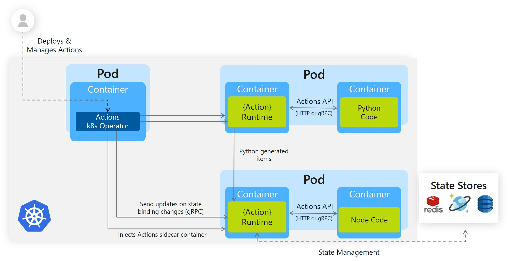

# Hello Kubernetes

This tutorial will get you up and running with Actions in a Kubernetes cluster. We'll be deploying a python app that generates messages and a Node app that consumes and persists them. The following architecture diagram illustrates the components that make up this sample: 



## Step 1 - Setup Actions on your Kubernetes Cluster

The first thing you need is an RBAC enabled Kubernetes cluster. This could be running on your machine using Minikube, or it could be a fully-fledged cluser in Azure using [AKS](https://azure.microsoft.com/en-us/services/kubernetes-service/). Once you have a cluster, follow [these steps](/../../#install-on-kubernetes) to deploy Actions to it.


## Step 2 - Create and Configure a State Store

Actions can use a number of different state stores (Redis, CosmosDB, DynamoDB, Cassandra, etc.) to persist and retrieve state. For this demo, we'll use Redis.

1. Follow [these steps](../../docs/components/redis.md#Creating-a-Redis-Store) to create a Redis store.
2. Once your store is created, add the keys to the `redis.yaml` file in the `deploy` directory. 
    > **Note:** the `redis.yaml` file provided in this sample takes plain text secrets. In a production-grade application, follow [secret management](https://github.com/actionscore/actions/blob/master/docs/components/secrets.md) instructions to securely manage your secrets.
3. Apply the `redis.yaml` file: `kubectl apply -f ./deploy/redis.yaml` and observe that your state store was successfully configured!

```bash
component.actions.io "statestore" configured
```

## Step 3 - Understand the Code

Now that we've setup actions and state, let's take a look at our services. Navigate to the Node.js app in the Kubernetes sample: `cd samples/2.hello-kubernetes/node.js`.

In the `app.js` you'll find a simple `express` application, which exposes a few routes and handlers.

Let's take a look at the ```neworder``` handler:

```js
app.post('/neworder', (req, res) => {
    const data = req.body.data;
    const orderId = data.orderId;
    console.log("Got a new order! Order ID: " + orderId);

    const state = [{
        key: "order",
        value: data
    }];

    fetch(`${actionsUrl}/state`, {
        method: "POST",
        body: JSON.stringify(state),
        headers: {
            "Content-Type": "application/json"
        }
    }).then((response) => {
        console.log((response.ok) ? "Successfully persisted state" : "Failed to persist state");
    });

    res.status(200).send();
});
```

Here we're exposing an endpoint that will receive and handle `neworder` messages. We first log the incoming message, and then persist the order ID to our Redis store by posting a state array to the `/state` endpoint.

Alternatively, we could have persisted our state by simply returning it with our response object:

```js
res.json({
        state: [{
            key: "order",
            value: order
        }]
    })
```

We chose to avoid this approach, as it doesn't allow us to verify if our message successfully persisted.

We also expose a GET endpoint, `/order`:

```js
app.get('/order', (_req, res) => {
    fetch(`${actionsUrl}/state/order`)
        .then((response) => {
            return response.json();
        }).then((orders) => {
            res.send(orders);
        });
});
```

This calls out to our Redis cache to grab the latest value of the "order" key, which effectively allows our Node.js app to be _stateless_. 

## Step 4 - Deploy the Node.js App with the Actions Sidecar

```
kubectl apply -f ./deploy/node.yaml
```

This will deploy our Node.js app to Kubernetes. The Actions control plane will automatically inject the Actions sidecar to our Pod. If you take a look at the ```node.yaml``` file, you will see how Actions is enabled for that deployment:

```actions.io/enabled: true``` - this tells the Action control plane to inject a sidecar to this deployment.

```actions.io/id: nodeapp``` - this assigns a unique id or name to the Action, so it can be sent messages to and communicated with by other Actions.

You'll also see the container image that we're deploying. If you want to update the code and deploy a new image, see **Next Steps** section. 

This deployment provisions an External IP.
Wait until the IP is visible: (may take a few minutes)

```
kubectl get svc nodeapp
```

Once you have an external IP, save it.
You can also export it to a variable:

```
export NODE_APP=$(kubectl get svc nodeapp --output 'jsonpath={.status.loadBalancer.ingress[0].ip}')
```

## Step 5 - Deploy the Python App with the Actions Sidecar
Next, let's take a quick look at our python app. Navigate to the python app in the kubernetes sample: `cd samples/2.hello-kubernetes/python/app.py`.

At a quick glance, this is a basic python app that posts JSON messages to ```localhost:3500```, which is the default listening port for Actions. We invoke our Node.js application's `neworder` endpoint by posting to `v1.0/invoke/nodeapp/method/neworder`. Our message contains some `data` with an orderId that increments once per second:

```python
actions_url = "http://localhost:3500/v1.0/invoke/nodeapp/method/neworder"
n = 0
while True:
    n += 1
    message = {"data": {"orderId": n}}

    try:
        response = requests.post(actions_url, json=message)
    except Exception as e:
        print(e)

    time.sleep(1)
```

Let's deploy the python app to your Kubernetes cluster:
```
kubectl apply -f ./deploy/python.yaml
```

Now let's just wait for the pod to be in ```Running``` state:

```
kubectl get pods --selector=app=python -w
```

## Step 6 - Observe Messages

Now that we have our Node.js and python applications deployed, let's watch messages come through.<br>
Get the logs of our Node.js app:

```
kubectl logs --selector=app=node -c node
```

If all went well, you should see logs like this:

```
Got a new order! Order ID: 1
Successfully persisted state
Got a new order! Order ID: 2
Successfully persisted state
Got a new order! Order ID: 3
Successfully persisted state
```

## Step 7 - Confirm Successful Persistence

Hit the Node.js app's order endpoint to get the latest order. Grab the external IP address that we saved before and, append "/order" and perform a GET request against it (enter it into your browser, use Postman, or curl it!):

```
curl $NODE_APP/order
{"orderID":"42"}
```

You should see the latest JSON in response!

## Step 8 - Cleanup

Once you're done using the sample, you can spin down your Kubernetes resources by navigating to the `./deploy` directory and running:

```bash
kubectl delete -f .
```

This will spin down each resource defined by the .yaml files in the `deploy` directory, including the state component.

## Next Steps

Now that you're successfully working with actions, you probably want to update the sample code to fit your scenario. The Node.js and Python apps that make up this sample are deployed from container images hosted on a private [Azure Container Registry](https://azure.microsoft.com/en-us/services/container-registry/). To create new images with updated code, you'll first need to install docker on your machine. Next, follow these steps:

1. Update Node or Python code as you see fit!
2. Navigate to the directory of the app you want to build a new image for.
3. Run `docker build -t <YOUR_IMAGE_NAME> . `. You can name your image whatever you like. If you're planning on hosting it on docker hub, then it should start with `<YOUR_DOCKERHUB_USERNAME>/`.
4. Once your image has built you can see it on your machines by running `docker images`.
5. To publish your docker image to docker hub (or another registry), first login: `docker login`. Then run`docker publish <YOUR IMAGE NAME>`.
6. Update your .yaml file to reflect the new image name.
7. Deploy your updated actions enabled app: `kubectl apply -f <YOUR APP NAME>.yaml`.
