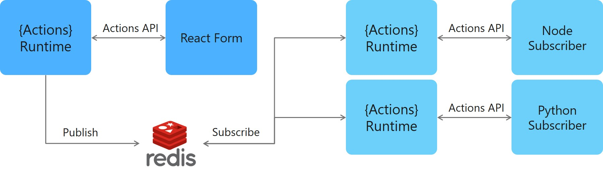
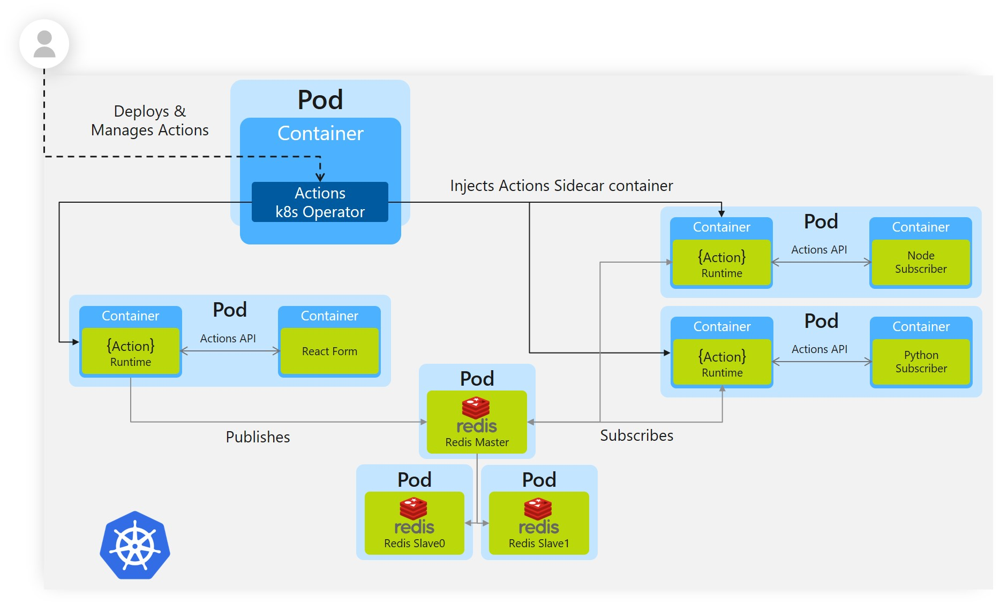

# Actions Pub-Sub Sample

In this sample, we'll create a publisher microservice and two subscriber microservices to demonstrate how Actions enables a publish-subcribe pattern. The publisher will generate messages of a specific topic, while subscribers will listen for messages of specific topics. See [Why Pub-Sub](#why-pub-sub) to understand when this pattern might be a good choice for your software architecture.

This sample includes one publisher:

- React front-end message generator

and two subscribers: 
 
- Node.js subscriber
- Python subscriber

Actions uses pluggable message buses to enable pub-sub, and delivers messages to subscribers in a [Cloud Events](https://github.com/cloudevents/spec) compliant message envelope. in this case we'll use Redis Streams (enabled in Redis versions => 5). The following architecture diagram illustrates how components interconnect locally:



Actions allows us to deploy the same microservices from our local machines to the cloud. Correspondingly, this sample has instructions for deploying this project [locally](#Run-Locally) or in [Kubernetes](#Run-in-Kubernetes). 

## Prerequisites

### Prerequisites to Run Locally

- [Actions CLI with Actions initialized](/../../#Install-as-standalone)
- [Node.js version 8 or greater](https://nodejs.org/en/) and/or [Python 3.4 or greater](https://www.python.org/): You can run this sample with one or both microservices

### Prerequisites to Run in Kubernetes

- [Actions enabled Kubernetes cluster](/../../#Install-on-Kubernetes)

## Run Locally

In order to run the pub/sub sample locally, we need to run each of our microservices with Actions. We'll start by running our messages subscribers. 

> **Note**: These instructions deploy a Node subscriber and a Python subscriber, but if you don't have either Node or Python, feel free to run just one.

### Run Node Message Subscriber with Actions

1. Navigate to Node subscriber directory in your CLI: `cd node-subscriber`
2. Install dependencies: `npm install`
3. Run Node subscriber app with Actions: `actions run --app-id node-subscriber --app-port 3000 node app.js`
    
    We assign `app-id`, which can be whatever unique identifier we like. We also assign `app-port`, which is the port that our Node application is running on. Finally, we pass the command to run our app: `node app.js`

### Run Python Message Subscriber with Actions

1. Open a new CLI window and navigate to Python subscriber directory in your CLI: `cd python_subscriber`
2. Install dependencies: `pip install -r requirements.txt`
3. Run Python subscriber app with Actions: `actions run --app-id python-subscriber --app-port 5000 python app.py`
    
    We assign `app-id`, which can be whatever unique identifier we like. We also assign `app-port`, which is the port that our Node application is running on. Finally, we pass the command to run our app: `python app.py`

### Use the CLI to Publish Messages to Subscribers

The Actions CLI provides a mechanism to publish messages for testing purposes. Let's test that our subscribers are listening!

1. Use Actions CLI to publish a message:
   
    * Linux/Mac:
    ```bash
    actions publish --topic A --payload '{ "message": "This is a test" }'
    ```
    * Windows
    ```bash
    actions publish --topic A --payload "{ \"message\": \"This is a test\" }"
    ```
    Both our Node.js and Python subscribers subscribe to topic A and log when they receive a message. Note that logs are showing up in the console window where we ran each one: 
    
    ```bash
        [0m?[94;1m== APP == Topic A: { id: '5780e2ca-f526-4839-92e5-a0a30aff829a', source: 'react-form', type: 'com.actions.event.sent', specversion: '0.3',data: { message: 'this is a test' } }
    ```

2. **Optional**: If you're running both the Node and Python apps, try publishing a message of topic B. You'll notice that only the Node app will receive this message. We'll discuss how these microservices are subscribing to specific topics in [How it Works](#How-it-Works).

### Run the React Front End with Actions

Now let's run our React front end with Actions. Our front end will publish different kinds of messages that our subscribers will pick up.

1. Open a new CLI window and navigate to the react-form directory: `cd react-form`
2. Run the React front end app with Actions: `actions run --app-id react-form --app-port 8080 npm run buildandstart`. This may take a minute, as it downloads dependencies and creates an optimized production build. You'll know that it's done when you see `== APP == Listening on port 8080!` and several Actions logs.
3. Open the browser and navigate to "http://localhost:8080/". You should see a form with a dropdown for message type and message text: 


4. Pick a topic, enter some text and fire off a message! Observe the logs coming through your respective Actions. Note that the Node.js subscriber receives messages of type "A" and "B", while the Python subscriber receives messages of type "A" and "C".

5. If you want to deploy this same application to Kubernetes, move onto the next step. Otherwise, skip ahead to the [How it Works](#How-it-Works) section to understand the code!

## Run in Kubernetes

To run the same sample in Kubernetes, we'll need to first set up a Redis store and then deploy our microservices. We'll be using the same microservices, but ultimately our architecture is a bit different: 



### Setting up a Redis Store

Actions uses pluggable message buses to enable pub-sub, in this case we'll use Redis Streams (enabled in Redis version 5 and above). We'll install Redis into our cluster using helm, but keep in mind that you could use whichever Redis host you like, as long as the version is greater than 5.

1. Follow [these steps](../../docs/components/redis.md#Creating-a-Redis-Cache-in-your-Kubernetes-Cluster-using-Helm) to create a Redis store using Helm. 
   > **Note**: Currently the version of Redis supported by Azure Redis Cache is less than 5, so using Azure Redis Cache will not work.
2. Once your store is created, add the keys to the `redis.yaml` file in the `deploy` directory. Don't worry about applying the `redis.yaml`, as it will be covered in the next step. 
   > **Note:** the `redis.yaml` file provided in this sample takes plain text secrets. In a production-grade application, follow [secret management](https://github.com/actionscore/actions/blob/master/docs/components/secrets.md) instructions to securely manage your secrets.

### Deploy Assets

Now that we've set up the Redis store, we can deploy our assets.

1. In your CLI window, navigate to the deploy directory
2. Run `kubectl apply -f .` which will deploy our publisher and two subscriber microservices. It will also apply the redis configuration we set up in the last step.
3. Run `kubectl get pods` to see each pod being provisioned.
4. Run `kubectl get svc -w` to get the external IP exposed by our `react-form` microservice. This may take a minute.

### Use the Sample

1. Copy the external IP from the last step into your browser and observe the same React form that we saw locally!
2. Create and submit messages of different types.
3. To see the logs generated from your subscribers, first run `kubectl get pods` to get the pod names for each subscriber. Then run `kubectl logs <POD NAME> <CONTAINER NAME>`. For example, I can see the logs for my `node-subscriber` service by running: 

    ```bash
        kubectl logs node-subscriber-575bcd88f-2scrt node-subscriber
    ```

4. Note that the Node.js subscriber receives messages of type "A" and "B", while the Python subscriber receives messages of type "A" and "C".

### Cleanup

Once you're done using the sample, you can spin down your Kubernetes resources by navigating to the `./deploy` directory and running:

```bash
kubectl delete -f .
```

This will spin down each resource defined by the .yaml files in the `deploy` directory, including the state component.

## How it Works

Now that you've run the sample locally and/or in Kubernetes, let's unpack how this all works. Our app is broken up into two subscribers and one publisher:

### Node Message Subscriber

Navigate to the `node-subscriber` directory and open `app.js`, the code for our Node.js subscriber. Here we're exposing three  API endpoints using `express`. The first is a GET endpoint: 

```js
app.get('/actions/subscribe', (_req, res) => {
    res.json([
        'A',
        'B'
    ]);
});
```
This tells actions what topics we want to subscribe to. When deployed (locally or in Kubernetes), Actions will call out to my service to determine if it's subscribing to anything - this is how we tell it! The other two endpoints are POST endpoints:

```js
app.post('/A', (req, res) => {
    console.log("A: ", req.body);
    res.sendStatus(200);
});

app.post('/B', (req, res) => {
    console.log("B: ", req.body);
    res.sendStatus(200);
});
```

These handle messages of each topic type coming through. Note that we simply log the message. In a more complex application this is where we would include topic-specific handlers. 

### Python Message Subscriber

Navigate to the `python-subscriber` directory and open `app.py`, the code for our Python subscriber. As with our Node.js subscriber, we're exposing three API endpoints, this time using `flask`. The first is a GET endpoint: 

```python
@app.route('/actions/subscribe', methods=['GET'])
def subscribe():
    return jsonify(['A','C'])
```
Again, this is how we tell Actions what topics we want to subscribe to. In this case, we're subscribing to topics "A" and "C". We handle  messages of those topics with our other two routes:

```python
@app.route('/A', methods=['POST'])
def a_subscriber():
    print(f'A: {request.json}', flush=True)
    return json.dumps({'success':True}), 200, {'ContentType':'application/json'} 

@app.route('/C', methods=['POST'])
def c_subscriber():
    print(f'C: {request.json}', flush=True)
    return json.dumps({'success':True}), 200, {'ContentType':'application/json'}
```

Note: if we don't set `flush=True` we won't see the logs when we run `kubectl get logs...`. This is a product of Python's output buffering.

### React Front End

Our publisher is broken up into a client and a server:

#### Client

Our client is a simple single page React application that was bootstrapped with [Create React App](https://github.com/facebook/create-react-app). The relevant client code sits in `react-form/client/src/MessageForm.js` where we present a form to our users. As our users update the form, we update React state with the latest aggregated JSON data. By default the data is set to:

```js
{
    messageType: "A",
    message: ""
};
```
Upon submission of the form, we send the aggregated JSON data to our server:

```js
    fetch('/publish', {
        headers: {
            'Accept': 'application/json',
            'Content-Type': 'application/json'
        },
        method:"POST",
        body: JSON.stringify(this.state),
    });
```

#### Server

Our server is a basic express application that exposes a POST endpoint: `/publish`. This takes the requests from our client and publishes them against Actions. We use `body-parser` to parse the JSON out of the incoming requests:

```js
app.use(bodyParser.json());
```

This allows us to determine which topic to publish our message with. To publish messages against Actions, our URL needs to look like: `http://localhost:<ACTIONS_URL>/publish/<TOPIC>`, so our `publish` endpoint builds a URL and posts our JSON against it: 

```js
const publishUrl = `${actionsUrl}/publish/${req.body.messageType}`;
request( { uri: publishUrl, method: 'POST', json: req.body } );
```

Note how the `actionsUrl` determines what port Actions live on: 

```js
const actionsUrl = `http://localhost:${process.env.ACTIONS_PORT || 3500}/v1.0`;
```

By default, Actions live on 3500, but if we're running Actions locally and set it to a different port (using the `--port` flag in the CLI `run` command), then that port will be injected into our application as an environment variable.

Our server also hosts the React application itself by forwarding all other requests to our built client code:

```js
app.get('*', function (_req, res) {
  res.sendFile(path.join(__dirname, 'client/build', 'index.html'));
});
```

## Why Pub-Sub?

Developers use a pub-sub messaging pattern to achieve high scalability and looser coupling.

### Scalability

Pub-sub is generally used for large applications that need to be highly scalable. Pub-sub applications often scale better than traditional client-server applications.

### Loose Coupling

Pub-sub allows us to completely decouple our components. Our publishers need not be aware of any of their subscribers, nor must our subscribers be aware of publishers. This allows developers to write leaner microservices that don't take an immediate dependency on each other.
