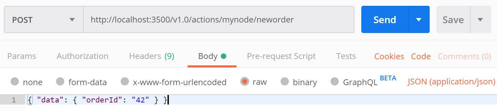

# From Zero to Hero Locally

This tutorial will demonstrate how to get Actions running locally on your machine. We'll be deploying a Node.js app that subscribes to order messages and persists them.

By the end of the end, you will know how to:

1. Set up Actions Locally
2. Understand the Code
3. Run the Node.js app with Actions
4. Post Messages to your Service
5. Confirm Successful Persistence

## Prerequisites
This sample depends requires you to have the following installed on your machine:
- [Docker](https://docs.docker.com/)
- [Node](https://nodejs.org/en/)
- [Postman](https://www.getpostman.com/)

## Step 1 - Setup Actions 

1. Download the [Actions CLI release](https://github.com/actionscore/cli/releases) for your OS

    **Note for Windows Users**: Due to a known bug, you must rename 'action' to 'actions.exe'

2. Add the path to `actions.exe` to your PATH
3. Run `actions init`, which will set up create two containers: the actions runtime and a redis state store. To validate that these two containers were successfully created, run `docker ps` and observe output: 
```
CONTAINER ID        IMAGE                   COMMAND                  CREATED             STATUS              PORTS                     NAMES
84b19574f5e5        actionscore.azurecr.io/actions:latest   "./assigner"             About an hour ago   Up About an hour    0.0.0.0:6050->50005/tcp   xenodochial_chatterjee
78d39ae67a95        redis                   "docker-entrypoint.s…"   About an hour ago   Up About an hour    0.0.0.0:6379->6379/tcp    hungry_dubinsky
```
4. Download actions repo: Clone repo: `git clone https://github.com/actionscore/actions.git`

## Step 2 - Understand the Code

Now that we've locally set up actions and cloned the repo, let's take a look at our local zero-to-hero sample. Navigate to the local_zero_to_hero sample: `cd samples/local_zero_to_hero/app.js`.

In the `app.js` you'll find a simple `express` application, which exposes a few routes and handlers.

Take a look at the ```neworder``` handler, which handles order messages, logs them and then persists them:

```
app.post('/neworder', (req, res) => {
    const data = req.body.data;
    const orderId = data.orderId;
    console.log("Got a new order! Order ID: " + orderId);

    const state = [{
        key: "order",
        value: data
    }];

    fetch("http://localhost:3500/state", {
        method: "POST",
        body: JSON.stringify(state),
        headers: {
            "Content-Type": "application/json"
        }
    }).then((response) => {
        console.log((response.ok) ? "Successfully persisted state" : "Failed to persist state");
    })

    res.status(200).send();
});
```

Here we're simply subscribing for `neworder` events by implementing a `/neworder` route and handler. When a message with `eventName` of "neworder" comes through, this handler will handle it. External event sources (e.g. [Azure Event Hubs](../azure_eventhubs.md)) or other actions can _publish_ events by that name and your service _subscribes_ to them.

Taking a look at the code, you can see that we log the  `orderId` of the message that comes through, and then persist it against our state store (Redis) by posting to the `/state` endpoint. 

Alternatively, we could have persisted our state by simply returning it with our response object:

```
res.json({
        state: {
            key: "order",
            value: order
        }
    })
```

We chose to avoid this approach, as it doesn't allow us to verify if our message successfully persisted.

## Step 3 - Run the Node.js App with Actions
 
1. Navigate to the zero to hero node sample project: `cd samples/local_zero_to_hero/app.js`

2. Install dependencies: `npm install`. This will install `express` and `body-parser`

3. Run node application with actions: `actions run --port 3500 --app-id mynode --app-port 3000 node app.js`. This should output text that looks like the following, along with logs:

```
Starting Actions with id mynode on port 3500
You're up and running! Both Actions and your app logs will appear here. 
...
```

4. Copy the Actions port for the next step

## Step 4 - Post Messages to your Service

Now that our actions and node app are running, let's post messages against it. 

 Open Postman and create a POST request against `http://localhost:<YOUR_PORT>/invoke/neworder`

In your terminal window, you should see logs indicating that the message was received and state was updated.

## Step 5 - Confirm Successful Persistence

Now, let's just make sure that we our order was successfully persisted to our state store. Create a GET request against: `http://localhost:<YOUR_PORT>/state/order`

Observe the expected result!
