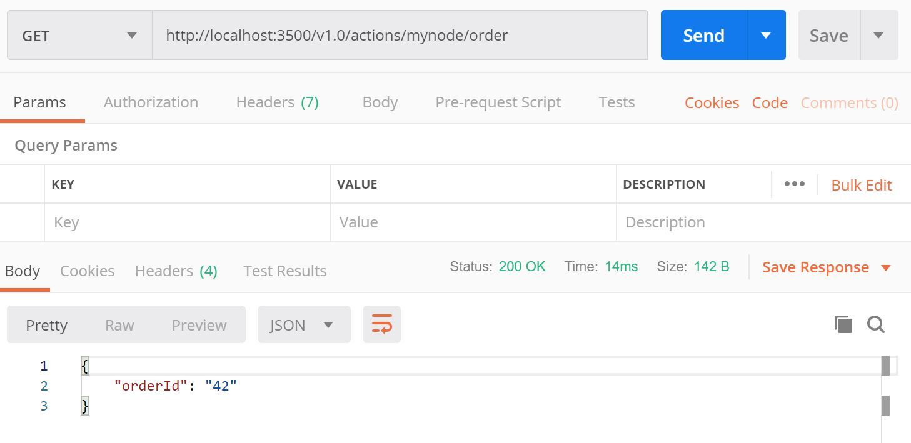

# From Zero to Hero Locally

This tutorial will demonstrate how to get Actions running locally on your machine. We'll be deploying a Node.js app that subscribes to order messages and persists them.

By the end of the end, you will know how to:

1. Set up Actions Locally
2. Understand the Code
3. Run the Node.js app with Actions
4. Post Messages to your Service
5. Confirm Successful Persistence

## Prerequisites
This sample depends requires you to have the following installed on your machine:
- [Docker](https://docs.docker.com/)
- [Node](https://nodejs.org/en/)
- [Postman](https://www.getpostman.com/)

## Step 1 - Setup Actions 

1. Download the [Actions CLI release](https://github.com/actionscore/cli/releases) for your OS

    **Note for Windows Users**: Due to a known bug, you must rename 'action' to 'actions.exe'

2. Add the path to `actions.exe` to your PATH
3. Run `actions init`, which will set up create two containers: the actions runtime and a redis state store. To validate that these two containers were successfully created, run `docker ps` and observe output: 
```
CONTAINER ID        IMAGE                   COMMAND                  CREATED             STATUS              PORTS                     NAMES
84b19574f5e5        yaron2/actionsedge:v2   "./assigner"             About an hour ago   Up About an hour    0.0.0.0:6050->50005/tcp   xenodochial_chatterjee
78d39ae67a95        redis                   "docker-entrypoint.s…"   About an hour ago   Up About an hour    0.0.0.0:6379->6379/tcp    hungry_dubinsky
```
4. Download actions repo: Clone repo: `git clone https://github.com/actionscore/actions.git`

## Step 2 - Understand the Code

Now that we've locally set up actions and cloned the repo, let's take a look at our local zero-to-hero sample. Navigate to the local_zero_to_hero sample: `cd samples/local_zero_to_hero/app.js`.

In the `app.js` you'll find a very simple `express` application, which exposes a few routes and handlers.

Take a look at the ```neworder``` handler:

```
app.post('/neworder', (req, res) => {
    data = req.body.data
    orderID = data.orderID

    console.log("Got a new order! Order ID: " + orderID)

    order = data
    
    res.json({
        state: [
            {
                key: "order",
                value: order
            }
        ]
    })
})
```

As you can see, in order to register for an event, you only need to listen on some event name. External event sources (e.g. [Azure Event Hubs](../azure_eventhubs.md)) or other actions can _publish_ events by that name and your service _subscribes_ to them.

But the Action doesn't stop there!
We are returning a JSON response to Actions saying we want to save a state in a key-value format:

```
res.json({
        state: {
            key: "order",
            value: order
        }
    })
```

All the heavy lifting, retries, concurrency handling etc. is handled by our invisible friend, Action.

Now that we save our state, we want to get it as soon as our process launches, so we can either reject the state and start clean or accept it.
To accomplish this, we simply expose a POST endpoint: `/state` 

```
app.post('/state', (req, res) => {
    e = req.body

    if (e.length > 0) {
        order = e[e.length - 1].value
    }

    res.status(200).send()
})
```

Here, we are simply assigning the last item of the state array back to our order value.

## Step 3 - Run the Node.js App with Actions
 
1. Navigate to the zero to hero nod sample project: `cd samples/local_zero_to_hero/app.js`

2. Install dependencies: `npm install`. This will install `express` and `body-parser`

3. Run node application with actions: `actions run --app-id mynode --app-port 3000 node app.js`. This should output text that looks like the following, along with logs:

```
Starting Actions with id mynode on port 50283
You're up and running! Both Actions and your app logs will appear here. 
...
```

4. Copy the Actions port for the next step

## Step 4 - Post Messages to your Service

Now that our actions and node app are running, let's post messages against it. 

 Open Postman and create a POST request against `http://localhost:<YOUR_PORT>/invoke/neworder`

In your terminal window, you should see logs indicating that the message was received and state was updated.

## Step 5 - Confirm Successful Persistence

Now, let's just make sure that we our order was successfully persisted to our state store. Create a GET request against: `http://localhost:<YOUR_PORT>/state/order`

Observe the expected result!