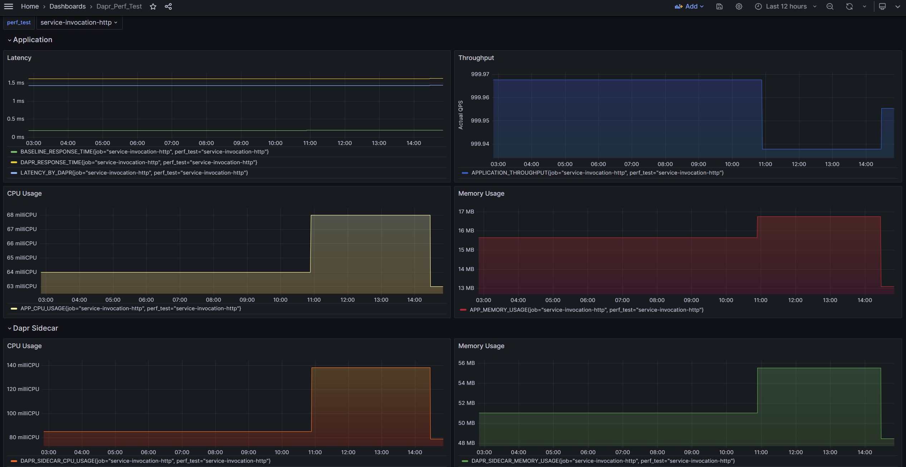

# Running Performance Tests

Performance tests are designed to let you evaluate the latency, resource usage and processing times for Dapr in your environment for a given hardware. The following describes how to run performance tests in a local dev environment and run them through CI:

  - [Run Performance tests in local dev environment](#run-perf-tests-in-local-dev-environment)
  - [Run Performance tests through GitHub Actions](#run-perf-tests-through-github-actions)

## Run Performance tests in local dev environment

### Prerequisites

* Kubernetes cluster (Minikube and Kind are valid options too).
  - To setup a new Kind cluster and local registry, run `make setup-kind`.
* Set up [Dapr development environment](https://github.com/dapr/dapr/blob/master/docs/development/setup-dapr-development-env.md)
  - [Install the latest Helm v3](https://helm.sh/docs/intro/install/).
* Create your DockerHub ID
* Create dapr-tests namespace
    ```bash
    kubectl create namespace dapr-tests
    ```
* Set the environment variables
    - If using Kind, run `make describe-kind-env` and copy-and-paste the export commands displayed.

    ```bash
    export DAPR_REGISTRY=docker.io/your_dockerhub_id
    export DAPR_TAG=dev
    export DAPR_NAMESPACE=dapr-tests

    # Do not set DAPR_TEST_ENV if you do not use minikube
    export DAPR_TEST_ENV=minikube

    # Set the below environment variables if you want to use the different registry and tag for test apps
    # export DAPR_TEST_REGISTRY=docker.io/your_dockerhub_id
    # export DARP_TEST_TAG=dev
    # export DAPR_TEST_REGISTRY_SECRET=yourself_private_image_secret

    # Set the below environment variables to configure test specific settings for Fortio based tests.
    # DAPR_PERF_QPS sets the desired number of requests per second. Default is 1.
    # DAPR_PERF_CONNECTIONS sets the number of client connections used to send requests to Dapr. Default is 1.
    # DAPR_TEST_DURATION sets the duration of the test. Default is "1m".
    # DAPR_PAYLOAD_SIZE sets a payload size in bytes to test with. default is 0.
    # DAPR_SIDECAR_CPU_LIMIT sets the cpu resource limit on the Dapr sidecar. default is 4.0.
    # DAPR_SIDECAR_MEMORY_LIMIT sets the memory resource limit on the Dapr sidecar. default is 512Mi.
    # DAPR_SIDECAR_CPU_REQUEST sets the cpu resource request on the Dapr sidecar. default is 0.5.
    # DAPR_SIDECAR_MEMORY_REQUEST sets the memory resource request on the Dapr sidecar. default is 250Mi.
    export DAPR_PERF_QPS
    export DAPR_PERF_CONNECTIONS
    export DAPR_TEST_DURATION
    export DAPR_PAYLOAD_SIZE
    export DAPR_SIDECAR_CPU_LIMIT
    export DAPR_SIDECAR_MEMORY_LIMIT
    export DAPR_SIDECAR_CPU_REQUEST
    export DAPR_SIDECAR_MEMORY_REQUEST

    ```

### Deploy your dapr runtime change

Run the below commands to build and deploy dapr from your local disk

```bash
# Build Linux binaries
make build-linux

# Build Docker image with Linux binaries
make docker-build

# Push docker image to your dockerhub registry
make docker-push

# Deploy Dapr runtime to your cluster
make docker-deploy-k8s

# Install 3rd party software
make setup-3rd-party
```

### Register app configurations

```bash
make setup-app-configurations
```

### Optional: Disable tracing

```bash
export DAPR_DISABLE_TELEMETRY=true
```

### Optional: Apply this configuration to disable mTLS

```bash
make setup-disable-mtls
```

### Register the default component configurations for testing

```bash
make setup-test-components
```

### Build and push test apps to docker hub

Build docker images from apps and push the images to test docker hub.

```bash
# build perf apps docker image under apps/
make build-perf-app-all

# push perf apps docker image to docker hub
make push-perf-app-all
```

You can also build and push the test apps individually.

```bash
# build perf apps docker image under apps/
make build-perf-app-<app-name>

# push perf apps docker image to docker hub
make push-perf-app-<app-name>
```
`<app-name>` can be found at [PERF_TEST_APPS](https://github.com/dapr/dapr/blob/6def7d1b9ffe896b7b06d05128b9cd605d39f939/tests/dapr_tests.mk#L61C1-L61C15)

If you are building test apps individually, you need to build and push the tester app also:
- tester (`build-perf-app-tester` and `push-perf-app-tester`) for Fortio based tests
- k6-custom (`build-perf-app-k6-custom` and `push-perf-app-k6-custom`) for k6 based tests

### (k6) Install the k6-operator

If you are running k6 based tests, install the k6-operator.

```bash
make setup-test-env-k6
```

### Run performance tests

```bash
# start perf tests
make test-perf-all
```

You can also run selected tests using environment variables `DAPR_PERF TEST``.
```bash
export DAPR_PERF_TEST="<app-name-1> <app-name-2>"

# it will start perf tests defined in DAPR_PERF_TEST
make test-perf-all
```
Then it will run the tests defined in `DAPR_PERF_TEST`. `<app-name>` can be found at [PERF_TESTS](https://github.com/dapr/dapr/blob/6def7d1b9ffe896b7b06d05128b9cd605d39f939/tests/dapr_tests.mk#L70)

For example, if you only want to run `actor_id_scale` and `workflows` tests, you can do
```bash
export DAPR_PERF_TEST="actor_id_scale workflows"

make test-perf-all
```

### Remove all tests data
Once you finished your testing, it's recommended to remove old test data, so it's easier to find the new tests. 
You can run
```bash
make test-clean
```

## Run perf tests through GitHub Actions
To keep the build infrastructure simple, Dapr uses dapr-test GitHub Actions Workflow to run e2e tests using one of AKS clusters. A separate workflow also runs E2E in KinD clusters.

Once a contributor creates a pull request, E2E tests on KinD clusters are automatically executed for faster feedback. In order to run the E2E tests on AKS, ask a maintainer or approver to add /ok-to-perf comment to the Pull Request.


## Optional: Visualize Performance Test Metrics

```bash
export DAPR_PERF_METRICS_PROMETHEUS_PUSHGATEWAY_URL="http://localhost:9091"
```

Install the following in your Kubernetes cluster:

 - Prometheus 
 - Pushgateway
 - Grafana


### Create a new namespace

Create a new namesapce:

  ```bash
  DAPR_PERF_METRICS_NAMESPACE=dapr-perf-metrics
  kubectl create namespace $DAPR_PERF_METRICS_NAMESPACE
  ```

### Setup for Prometheus Server

```bash
helm repo add prometheus-community https://prometheus-community.github.io/helm-charts 
helm repo update
helm install --namespace $DAPR_PERF_METRICS_NAMESPACE prometheus prometheus-community/prometheus
```

### Setup for Prometheus Pushgateway

The Prometheus installation above comes with a pushgateway. 

* Forward port 9091 from your local machine to the prometheus-pushgateway pod and access it on `http://localhost:9091` 

  ```bash
  kubectl port-forward --namespace $DAPR_PERF_METRICS_NAMESPACE deployment/prometheus-prometheus-pushgateway 9091
  ```

### Setup for Grafana Server

* Create a `grafana.yaml` file with the following configurations:

  ```yaml
  apiVersion: apps/v1
  kind: Deployment
  metadata:
    name: grafana
    namespace: dapr-perf-metrics
  spec:
    replicas: 1
    selector:
      matchLabels:
        app: grafana
    template:
      metadata:
        labels:grafana
          app: grafana
      spec:
        containers:
          - name: grafana
            image: grafana/grafana:latest
            ports:
              - containerPort: 3000
  ---
  apiVersion: v1
  kind: Service
  metadata:
    name: grafana
    namespace: dapr-perf-metrics
  spec:
    type: LoadBalancer
    ports:
      - port: 80
        targetPort: 3000
        protocol: TCP
    selector:
      app: grafana
  ```

* Apply the configurations
  
  ```bash
  kubectl apply -f grafana.yaml
  ```

* Forward port 3000 from your local machine to the pod where Grafana is running.
  
  ```bash
  kubectl port-forward --namespace $DAPR_PERF_METRICS_NAMESPACE deployment/grafana 3000
  ```
  
  The Grafana server can now be accessed on localhost:3000
  
* Login to Grafana with the default username and password 'admin' for both.

* Now go to data sources and connect Prometheus as a data source.

* The HTTP URL will be the ClusterIP of the prometheus-server pod running on Kubernetes which can be obtained by the command:
  
  ```bash
  kubectl get svc --namespace $DAPR_PERF_METRICS_NAMESPACE
  ```

* [Grafana Dashboard for Perf Test](../grafana/grafana-perf-test-dashboard.json)
  
  On running the perf-tests now, the metrics are collected from pushgateway by Prometheus and is made available for visualization as a dashboard by importing the above template in Grafana.

### Sample dashboard view


