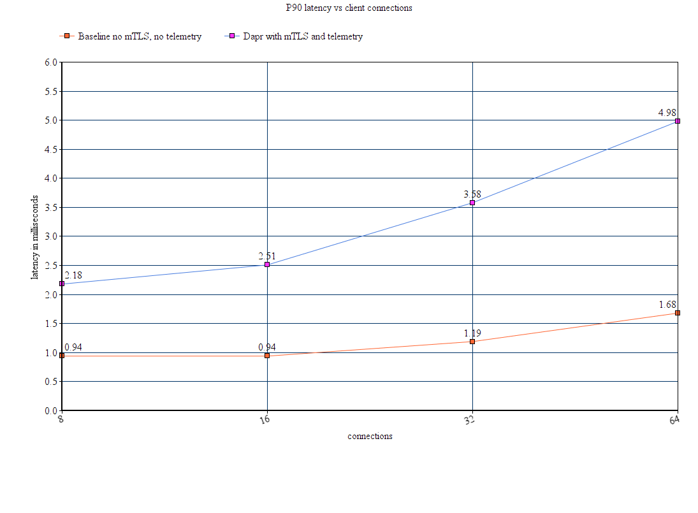
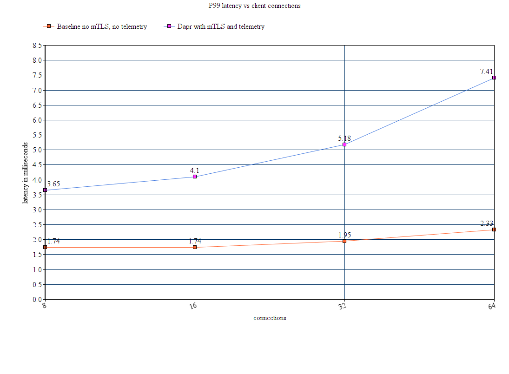

# Service Invocation Performance

This article provides service invocation API performance benchmarks and resource utilization for the components needed to run Dapr in different hosting environments.

## System overview

Dapr consists of a data plane, the sidecar that runs next to your app, and a control plane that configures the sidecars and provides capabilities such as cert and identity management.

### Self-hosted components

- Sidecar (data plane)
- Sentry (optional, control plane)
- Placement (optional, control plane)

For more information see [overview of Dapr in self-hosted mode](https://docs.dapr.io/operations/hosting/self-hosted/self-hosted-overview/).

### Kubernetes components

- Sidecar (data plane)
- Sentry (optional, control plane)
- Placement (optional, control planee)
- Operator (control plane)
- Sidecar Injector (control plane)

For more information see [overview of Dapr on Kubernetes](https://docs.dapr.io/operations/hosting/kubernetes/kubernetes-overview/).

## Performance summary for Dapr v1.0

The service invocation API is a reverse proxy with built-in service discovery to connect to other services. This includes tracing, metrics, mTLS for in-transit encryption of traffic, together with resiliency in the form of retries for network partitions and connection errors.

Using service invocation you can call from HTTP to HTTP, HTTP to gRPC, gRPC to HTTP, and gRPC to gRPC. Dapr does not use HTTP for the communication between sidecars, always using gRPC, while carrying over the semantics of the protocol used when called from the app. Service invocation is the underlying mechanism of communicating with Dapr Actors.

For more information see [service invocation overview](https://docs.dapr.io/developing-applications/building-blocks/service-invocation/service-invocation-overview/).

#### Kubernetes performance test setup

The test was conducted on a 3 node Kubernetes cluster, using commodity hardware running 4 cores and 8GB of RAM, without any network acceleration. The setup included a load tester ([Fortio](https://github.com/fortio/fortio)) pod with a Dapr sidecar injected into it that called the service invocation API to reach a pod on a different node.

Test parameters:

- 1000 requests per second
- Sidecar limited to 0.5 vCPU
- Sidecar mTLS enabled
- Sidecar telemetry enabled (tracing with a sampling rate of 0.1)
- Payload of 1KB

The baseline test included direct, non-encrypted traffic, without telemetry, directly from the load tester to the target app.

#### Control plane performance

The Dapr control plane uses a total of 0.009 vCPU and 61.6 Mb when running in non-HA mode, meaning a single replica per system component. When running in a highly available production setup, the Dapr control plane consumes ~0.02 vCPU and 185 Mb.

| **Component**      | **vCPU** | **Memory** |
|--------------------|----------|------------|
| `Operator`         | 0.001    | 12.5 Mb    |
| `Sentry`           | 0.005    | 13.6 Mb    |
| `Sidecar Injector` | 0.002    | 14.6 Mb    |
| `Placement`        | 0.001    | 	20.9 Mb   |

There are a number of variants that affect the CPU and memory consumption for each of the system components. These variants are shown in the table below.

| **Component**      | **vCPU**                                                                | **Memory**                      |
|--------------------|-------------------------------------------------------------------------|---------------------------------|
| `Operator`         | Number of pods requesting components, configurations and subscriptions	 |                                 |
| `Sentry`           | Number of certificate requests                                          |                                 |
| `Sidecar Injector` | Number of admission requests                                            |                                 |
| `Placement`        | Number of actor rebalancing operations                                  | Number of connected actor hosts |

#### Data plane performance

The Dapr sidecar uses 0.48 vCPU and 23Mb per 1000 requests per second. End-to-end, the Dapr sidecars (client and server) add ~1.40 ms to the 90th percentile latency, and ~2.10 ms to the 99th percentile latency. End-to-end here is a call from one app to another app receiving a response. This is shown by steps 1-7 [in this diagram](https://docs.dapr.io/developing-applications/building-blocks/service-invocation/service-invocation-overview/).

This performance is on par or better than commonly used service meshes.

#### Latency

In the test setup, requests went through the Dapr sidecar both on the client side (serving requests from the load tester tool) and the server side (the target app). mTLS and telemetry (tracing with a sampling rate of 0.1) and metrics were enabled on the Dapr test, and disabled for the baseline test.

