### TestParallelWorkflowWithMaxVUs 

#### T_110_440

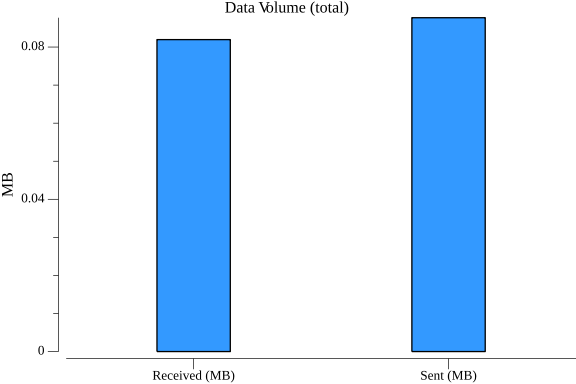
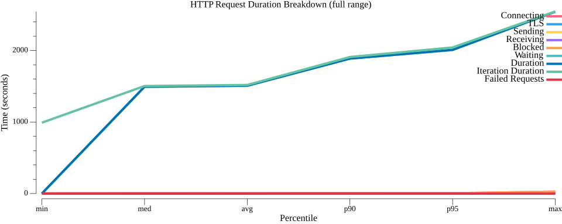
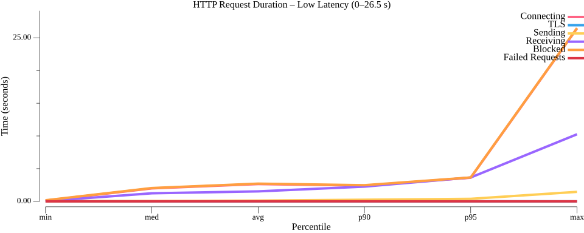

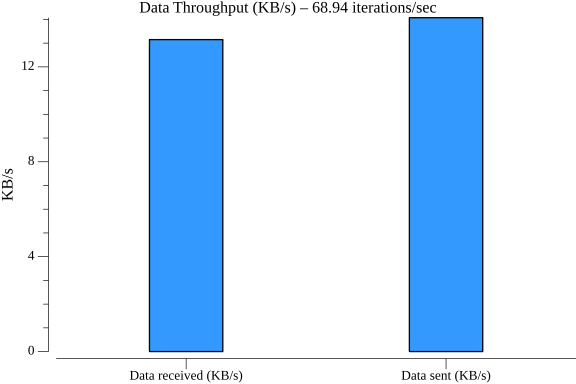

#### T_350_1400

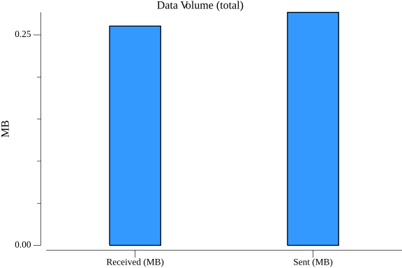
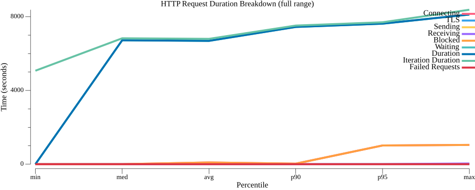

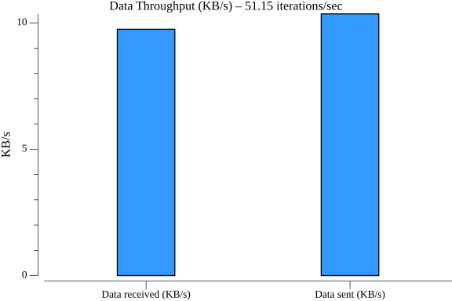

### TestWorkflowWithConstantIterations 

#### T_30_300

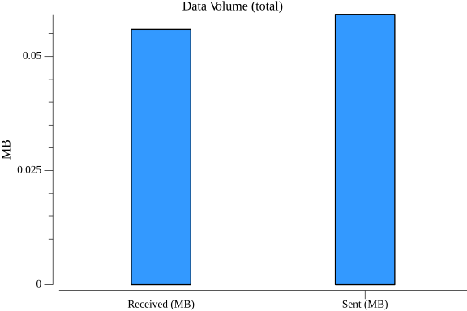
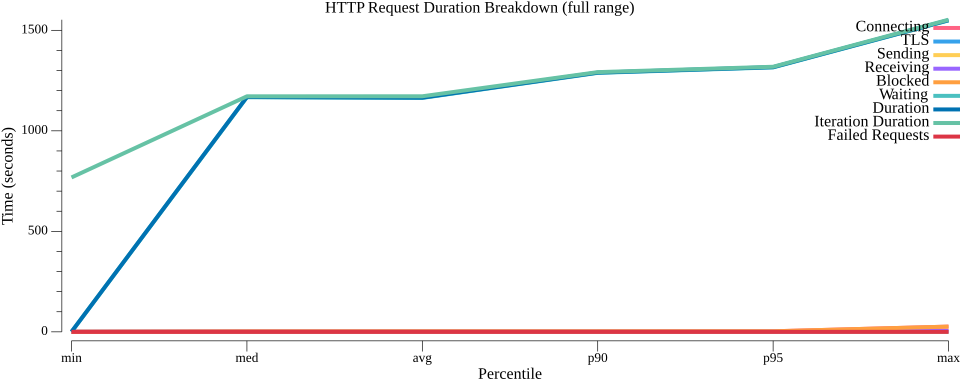
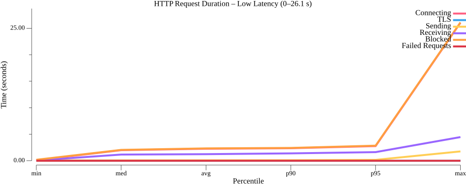
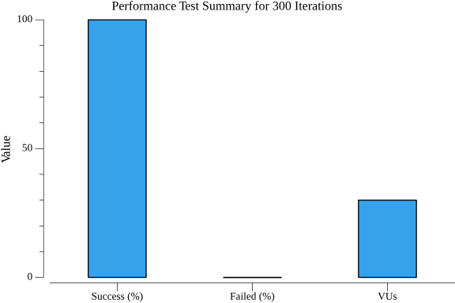
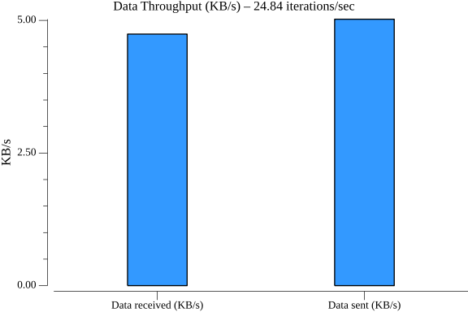

####  T_60_300

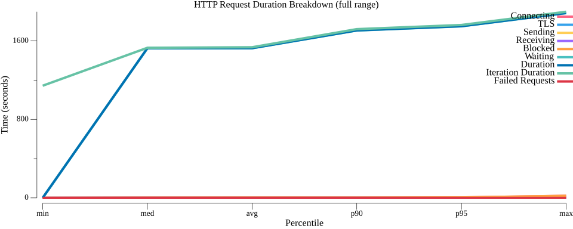
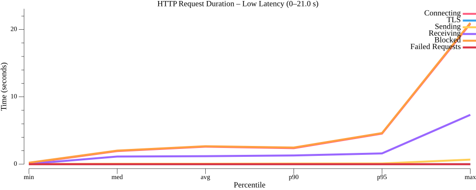

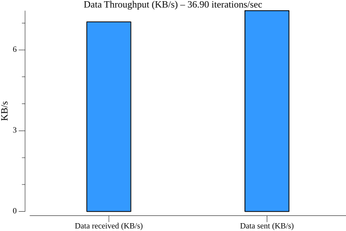

#### T_90_300

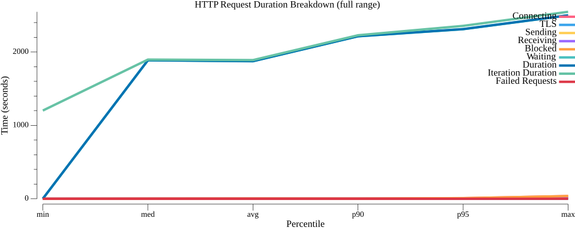
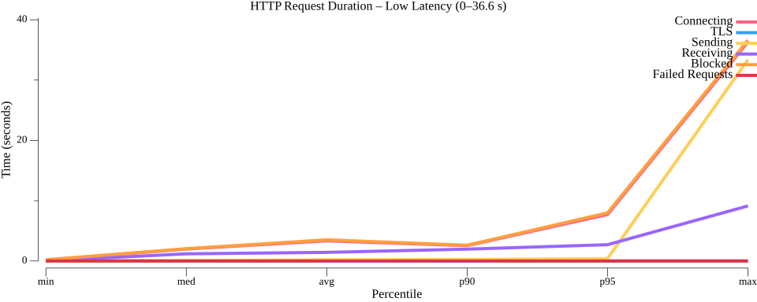
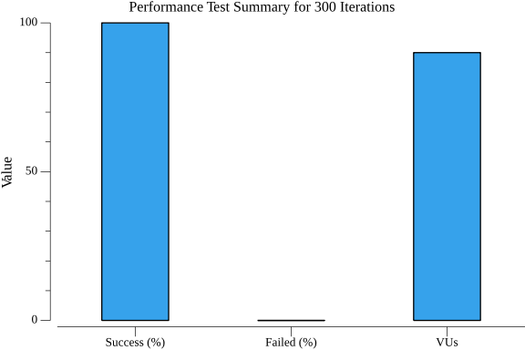
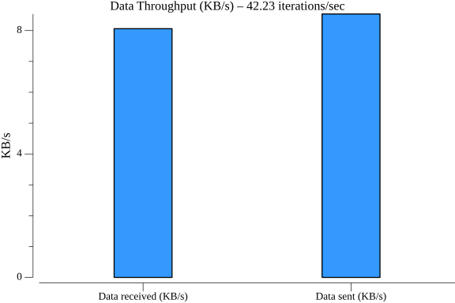

### TestWorkflowWithConstantVUs T_30_300

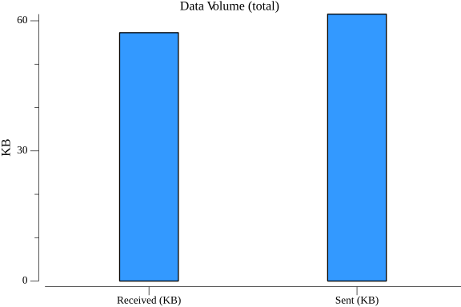
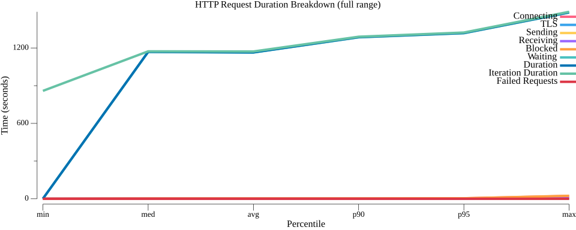

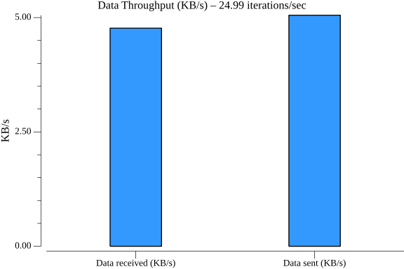
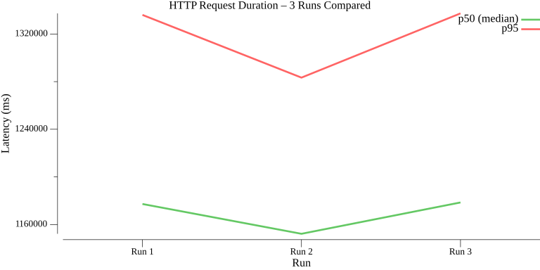

### TestWorkflowWithDifferentPayloads T_30_300

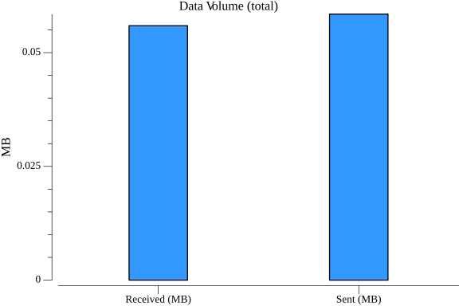
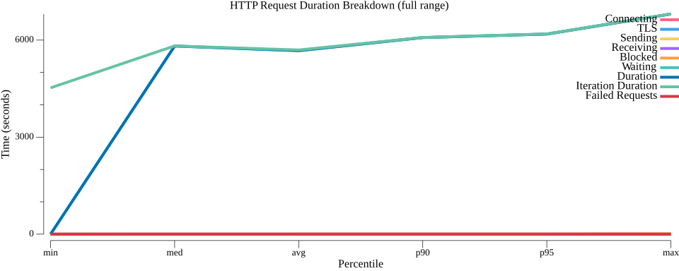

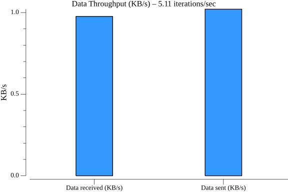
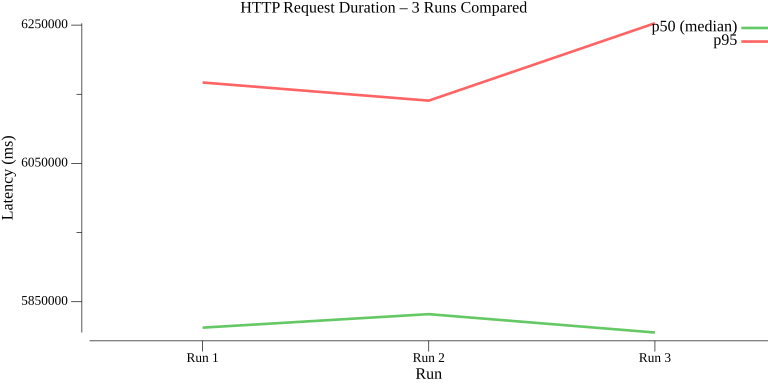
