## Highlights

**Configuration Get (gRPC)**:
- **26,810 iterations/sec** throughput | p50: **6.67 ms** | p90: **16.35 ms** | p95: **21.53 ms**
- 241,601 total requests — **100% success rate**

At over 26,000 reads per second, the gRPC configuration Get API is extremely fast. The 6.67 ms median covers the full round-trip through Dapr to the config store and back. Across 241,601 requests, not a single one failed — the system remained stable throughout the entire test.

**Configuration Subscribe (gRPC)**:
- **968 iterations/sec** | p50: **274 ms** | p95: **510.58 ms**
- Dapr overhead vs. baseline: **+1.82 ms at p95** (+0.36%) — effectively zero overhead
- 9,225 subscription checks — **100% success rate**

Subscribe measures how long a client waits to receive a configuration change notification after a change occurs in the store. The ~500 ms p95 is driven entirely by the config store's polling interval — Dapr's share of that wait is just 1.82 ms (+0.36% vs. baseline). Put another way, Dapr adds virtually no overhead to the subscription delivery path; the latency you see is the underlying store's update frequency.

---

### TestConfigurationGetGRPCPerformance

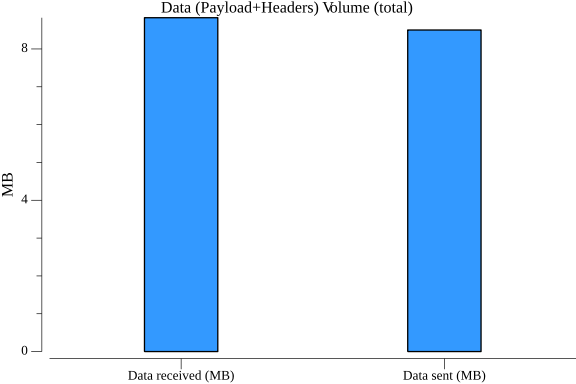
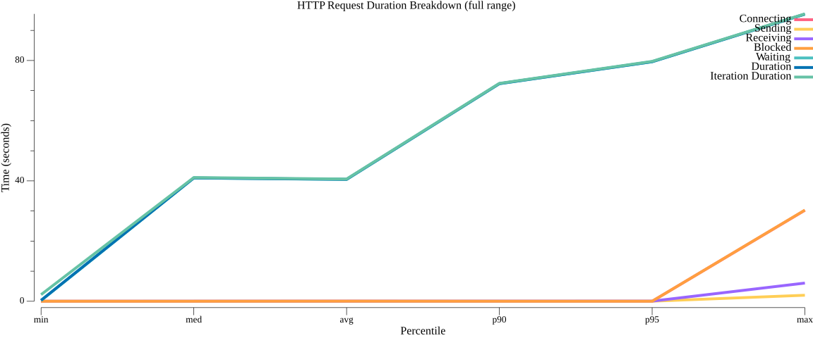
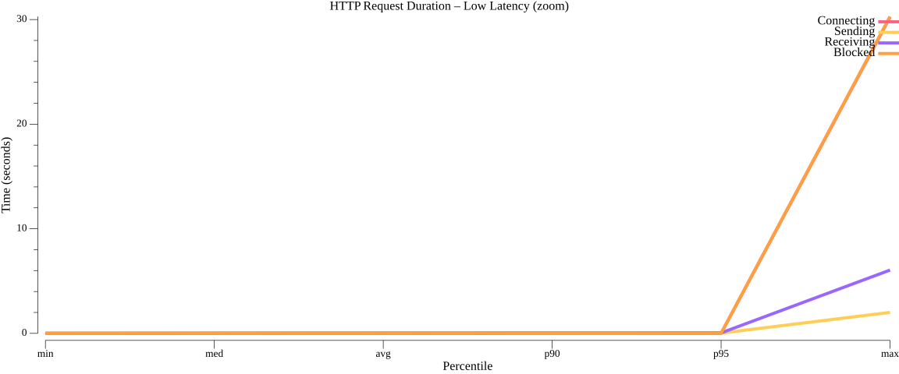

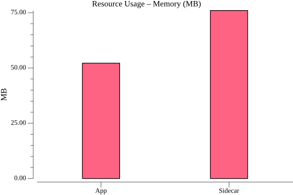

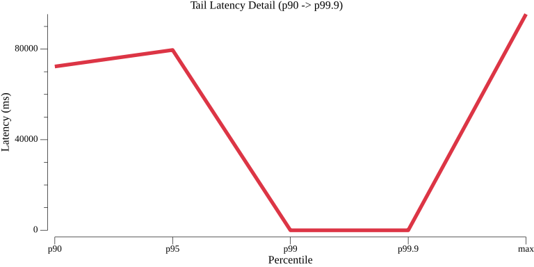
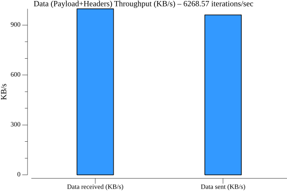

### TestConfigurationSubscribeGRPCPerformance

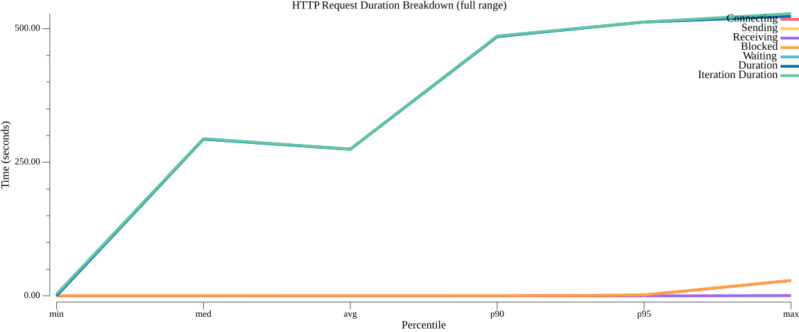
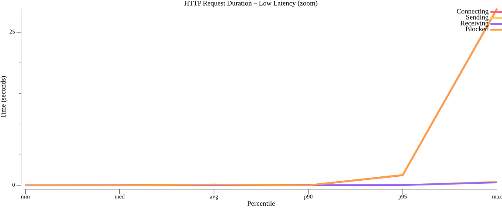

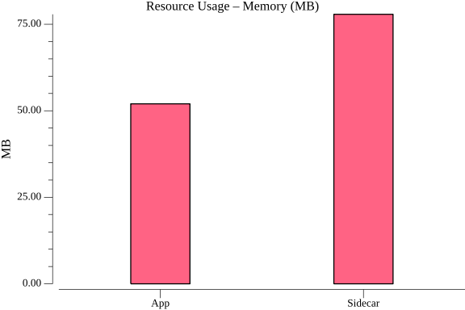
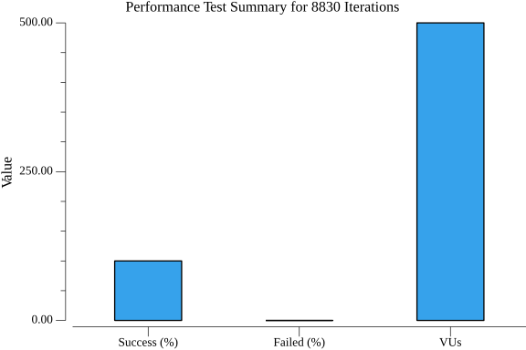
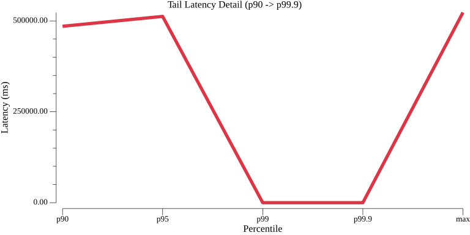
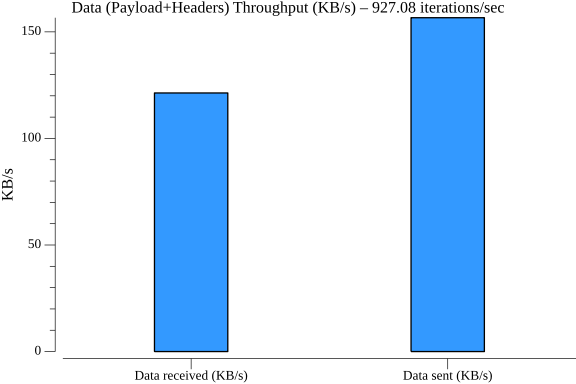
