## Highlights

**Configuration Get (HTTP)**:
- **23,326 iterations/sec** throughput | p50: **8.27 ms** | p90: **18.29 ms** | p95: **23.14 ms**
- 210,368 total requests — **100% success rate**

At over 23,000 reads per second, the HTTP configuration Get API delivers strong throughput with a consistent 8.27 ms median. The slightly lower throughput versus gRPC (23,326 vs. 26,810 iterations/sec) reflects HTTP/1.1 protocol overhead. Across 210,368 total requests, every single one succeeded.

**Configuration Subscribe (HTTP)**:
- **981 iterations/sec** | p50: **268 ms** | p95: **473 ms**
- 9,313 subscription checks — **100% success rate**

Subscribe measures how long a client waits to receive a configuration change notification. The ~470 ms p95 is driven by the config store's polling interval, not Dapr — the same as the gRPC subscribe path. HTTP subscribe handles 981 subscription checks per second with 100% delivery success. All 9,313 subscription events were received correctly.

---

### TestConfigurationGetHTTPPerformance

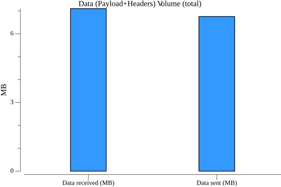

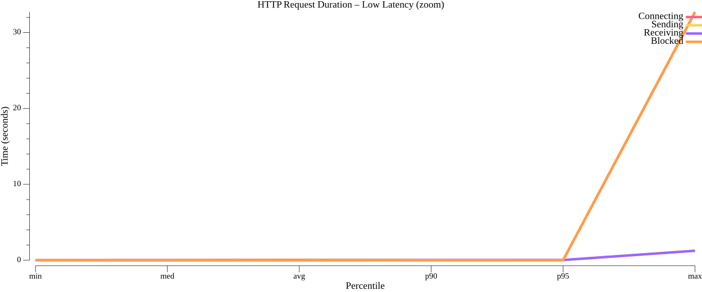

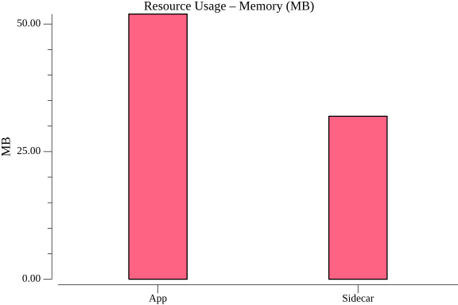

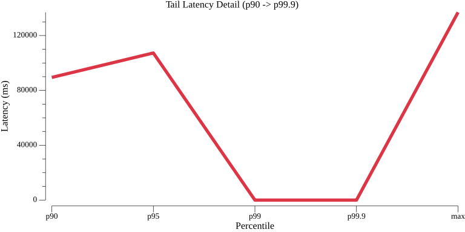
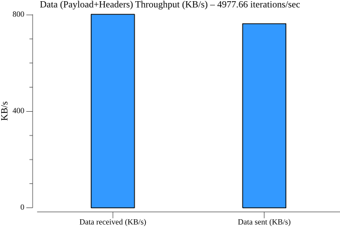

### TestConfigurationSubscribeHTTPPerformance

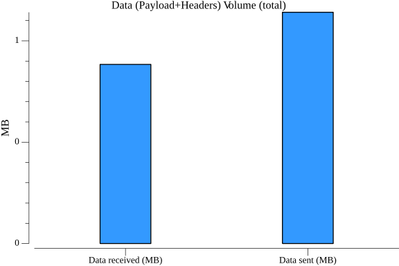
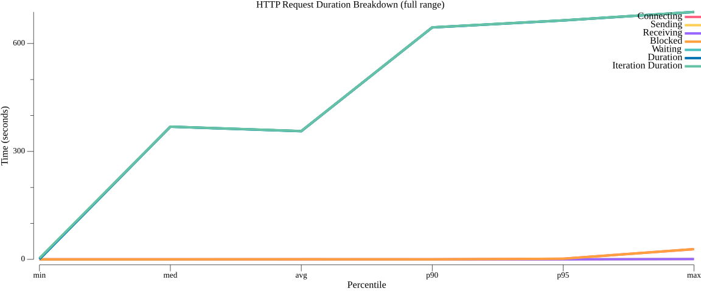
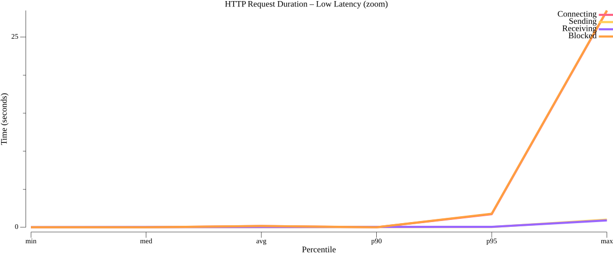

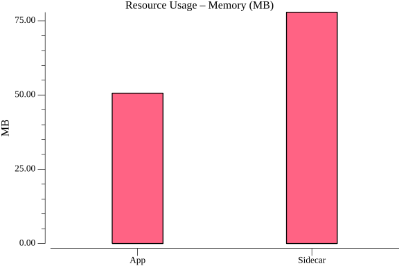
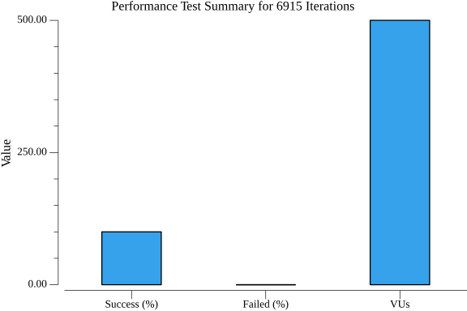
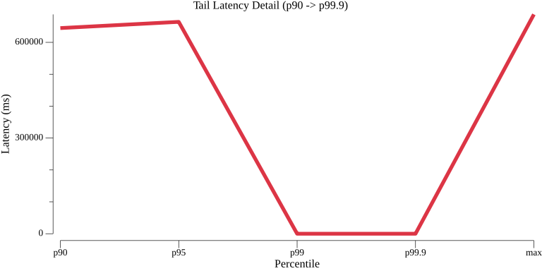

