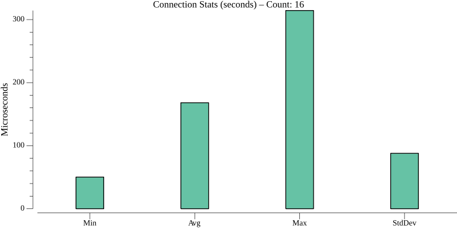
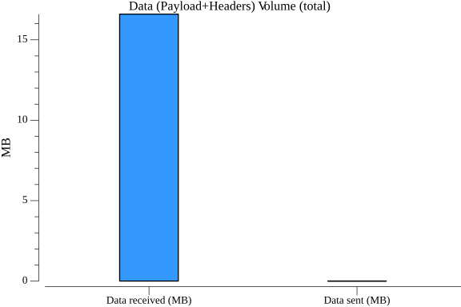
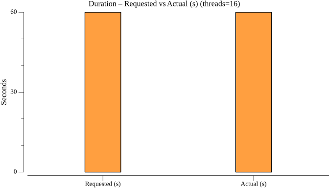
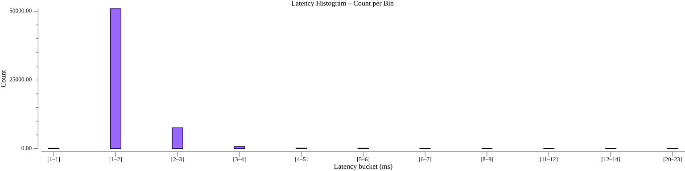
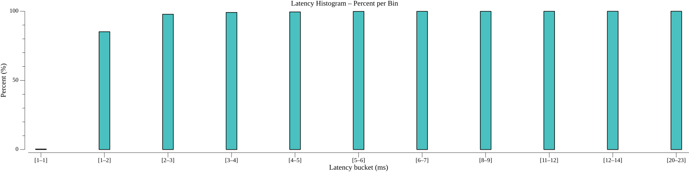
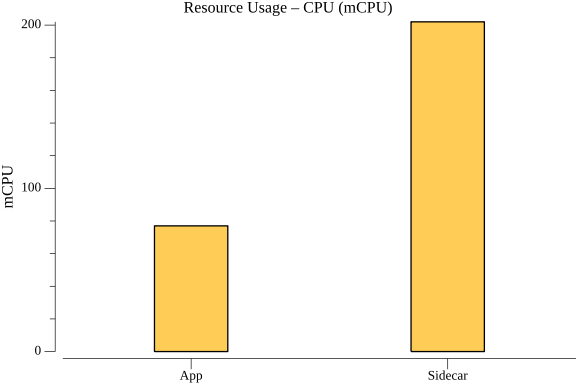
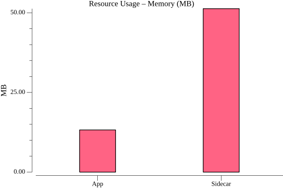
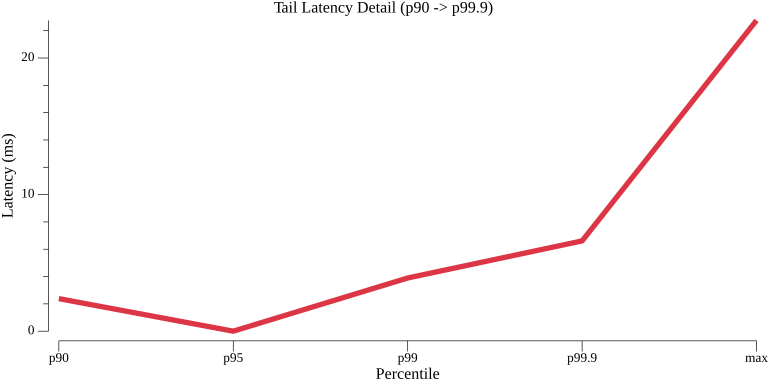
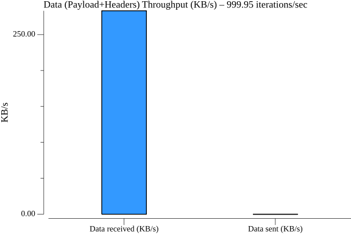

## Highlights

Service invocation is Dapr's core inter-service communication primitive. In v1.17, it delivers sub-2ms median latency over HTTP and sub-3ms over gRPC at 1,000 QPS sustained load — with zero failures across 60,000 requests per run.

**How to read these numbers:** Latency percentiles describe the distribution of individual request times — p50 (median) is the typical experience, p90 means 9 in 10 requests were faster, and p99 means only 1 in 100 took longer. "16 connections" means 16 parallel callers hitting the Dapr sidecar simultaneously at 1,000 QPS total. "Dapr overhead" is measured by running the same test without Dapr and subtracting — it represents the pure cost of the Dapr sidecar proxy layer.

**HTTP** (1 KB payload, 16 connections, 1,000 QPS target):
- Median (p50): **1.59 ms** | p90: **2.38 ms** | p99: **3.89 ms**
- Dapr adds **1.06 ms** at median vs. direct invocation
- 60,000 requests — **100% success rate**, 0 errors, 0 pod restarts

With 16 parallel connections sustaining 1,000 requests per second, the typical HTTP round-trip through Dapr was 1.59 ms end-to-end. Even the worst 1 in 100 requests (p99) stayed under 4 ms. Dapr's sidecar accounted for just 1.06 ms of that total — the rest is network and application time.

**gRPC** (1 KB payload, 16 connections, 1,000 QPS target):
- Median (p50): **2.25 ms** | p90: **2.92 ms** | p99: **4.59 ms**
- Dapr adds **1.68 ms** at median vs. direct invocation
- 60,000 requests — **100% success rate**, 0 errors, 0 pod restarts

The gRPC path adds slightly more sidecar overhead than HTTP (1.68 ms vs. 1.06 ms at median) because Dapr must participate in HTTP/2 framing on both sides of the connection. Even so, median latency stays under 2.5 ms at 1,000 QPS with a tight p90–p99 spread, indicating very consistent tail behavior.

Both transports hit their QPS targets with near-perfect accuracy (999.94–999.95 actual vs. 1,000 requested). The sidecar consumes under 250 mCPU and ~51 MB memory under this load.

---

## HTTP

### TestServiceInvocationHTTPPerformance

---------------

## gRPC

### TestServiceInvocationGrpcPerformance

