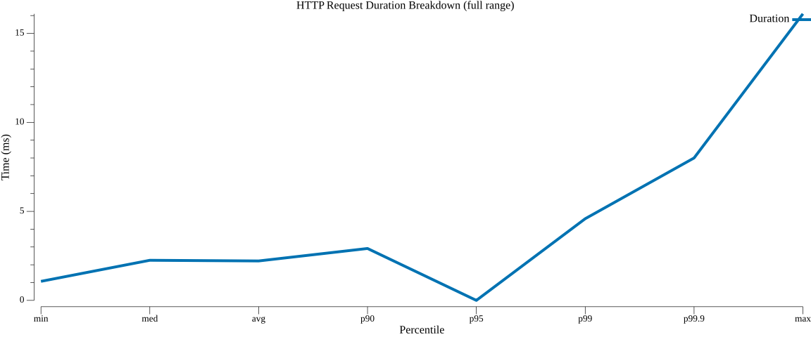
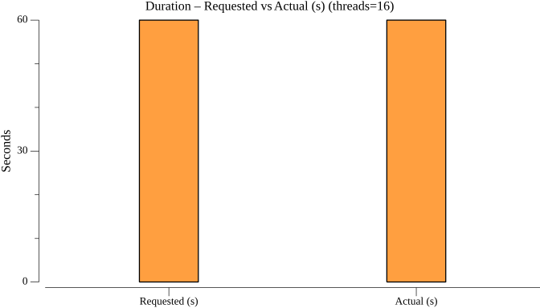
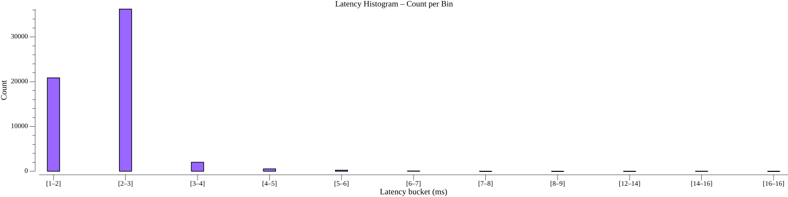
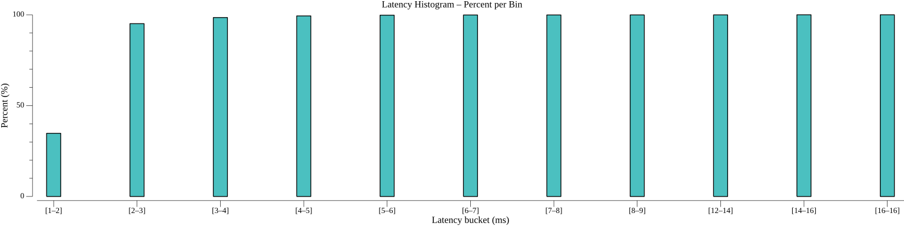
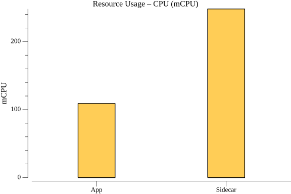
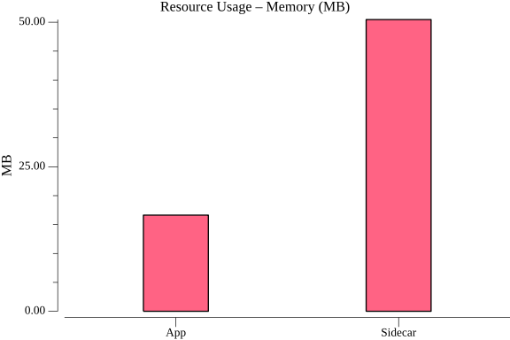
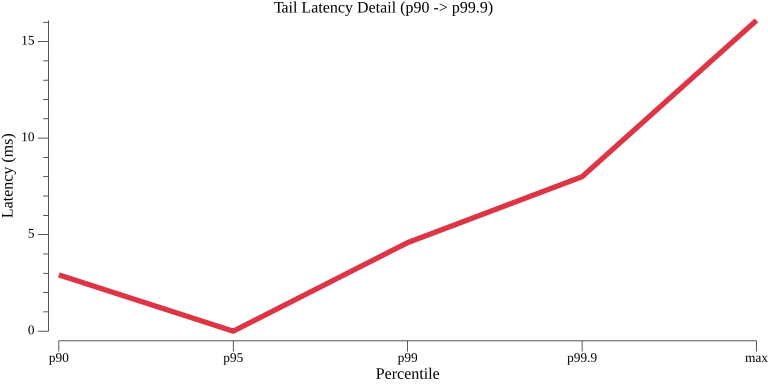

## Highlights

**gRPC service invocation** (1 KB payload, 16 connections, 1,000 QPS):
- Median (p50): **2.25 ms** | p90: **2.92 ms** | p99: **4.59 ms** | p99.9: **8.00 ms**
- Dapr overhead vs. direct: **+1.68 ms** at p50, **+1.97 ms** at p90, **+2.83 ms** at p99
- 60,000 requests — **100% success rate** (all SERVING), 0 pod restarts
- Sidecar: 248 mCPU, 50 MB memory at sustained 1,000 QPS

The 2.25 ms median covers the full round-trip: the gRPC client sends a request to the Dapr sidecar, Dapr routes it to the target app via its own gRPC connection, the app processes and responds, and the sidecar returns the result. Dapr's share of that time is 1.68 ms — the overhead of HTTP/2 framing, mTLS, and routing on both sides of the proxy hop. The tight p90–p99 spread (2.92 ms to 4.59 ms) means tail latency is well-controlled: even the slowest 1 in 100 requests completes in under 5 ms.

---

### TestServiceInvocationGrpcPerformance

