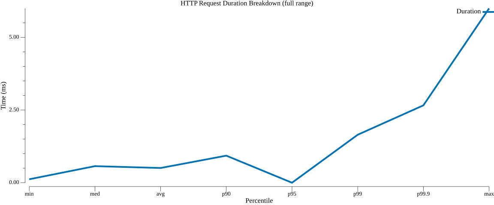
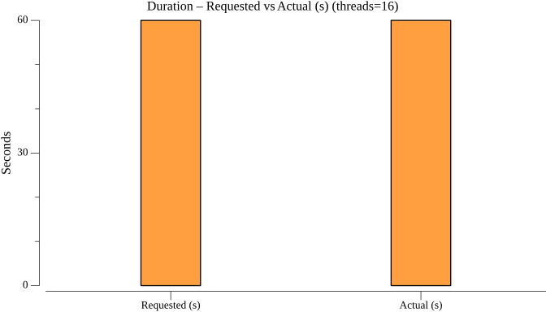
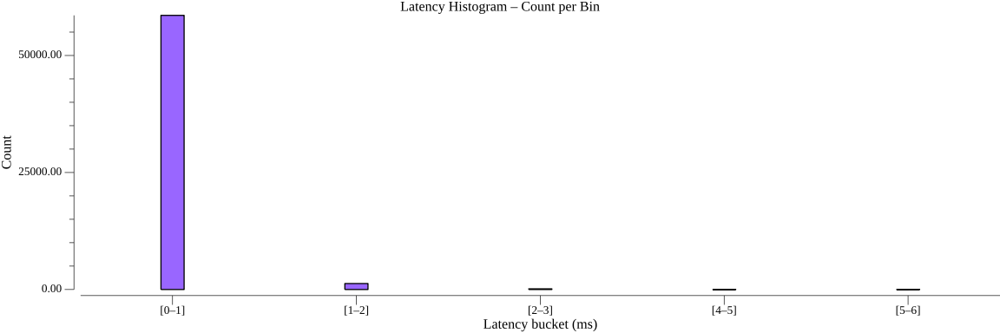
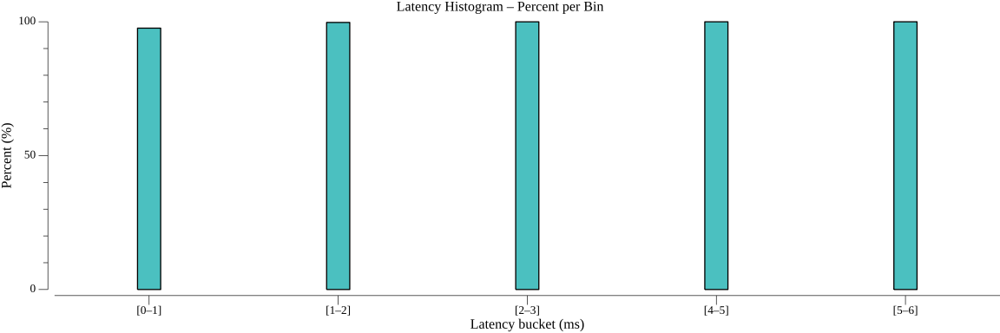
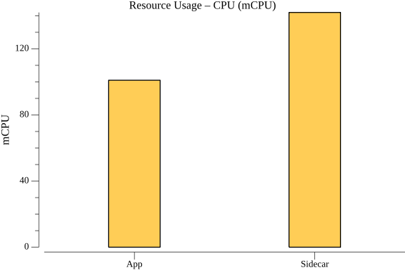
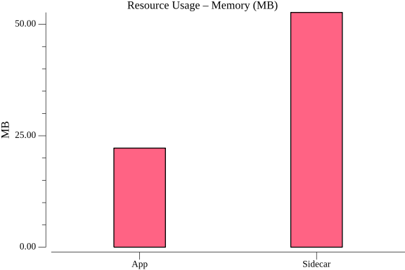
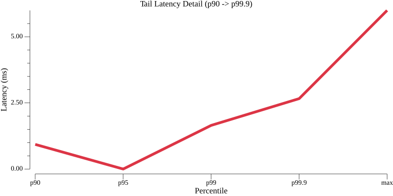

## Highlights

**gRPC state get** (16 connections, 1,000 QPS):
- Median (p50): **0.57 ms** | p90: **0.93 ms** | p99: **1.65 ms** | p99.9: **2.66 ms**
- Dapr overhead vs. direct: **+0.12 ms** at p50, **+0.04 ms** at p90, **+0.66 ms** at p99
- 60,000 requests — **100% success rate** (all SERVING), 0 pod restarts
- Sidecar: 142 mCPU, 53 MB memory at sustained 1,000 QPS

Sub-millisecond median latency at 1,000 QPS means state reads through Dapr are effectively instant in any real-world context. The Dapr sidecar added just 0.12 ms on top of going directly to the state store — this is the lowest overhead of any Dapr API surface tested. Even at p99.9 (the worst 1 in 1,000 requests), latency stays under 3 ms, showing extremely consistent performance under sustained load. The sidecar runs at 142 mCPU and 53 MB — a light footprint for 1,000 sustained QPS.

---

### TestStateGetGrpcPerformance

