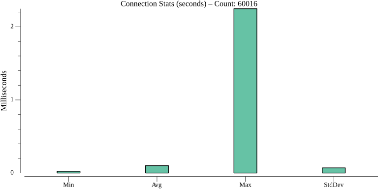
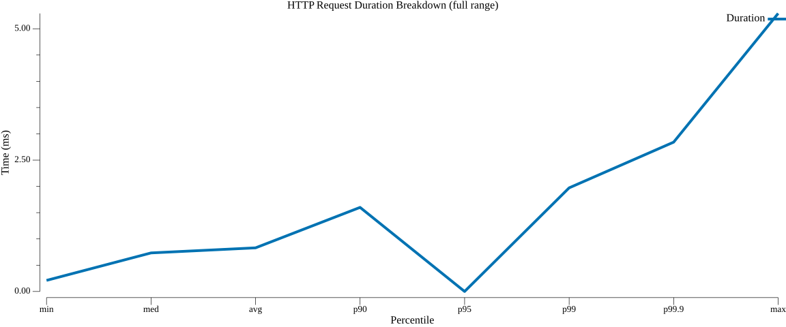
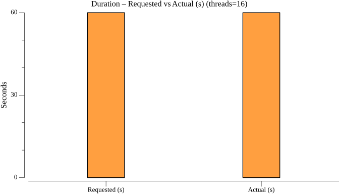
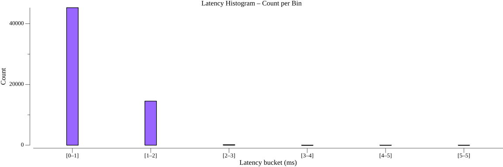
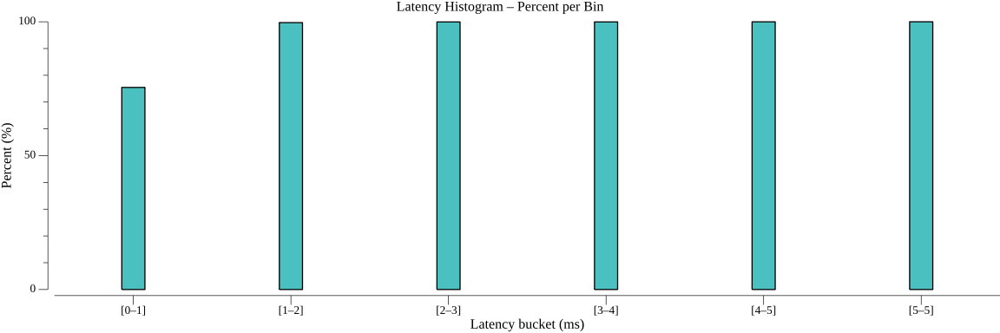
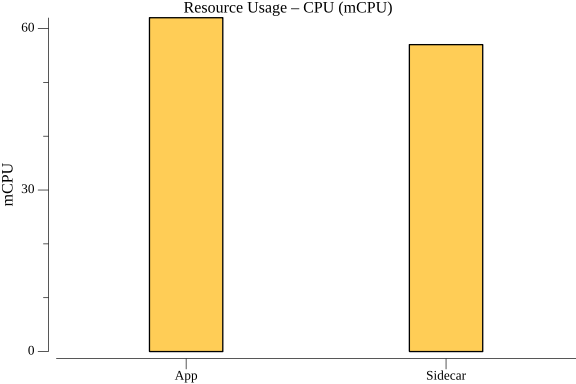
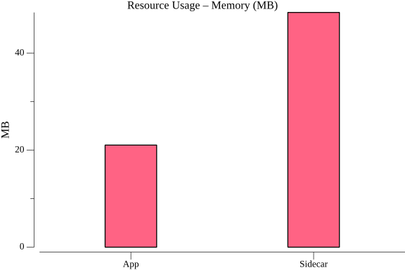
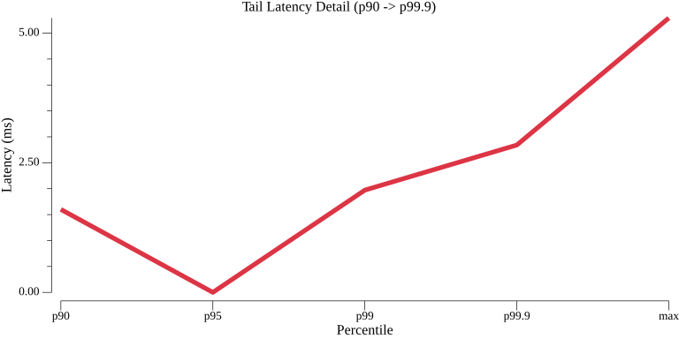
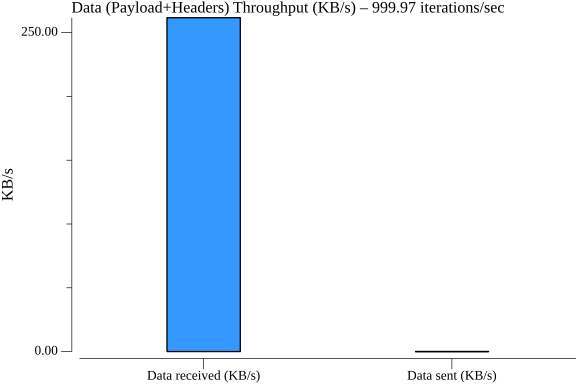

## Highlights

**HTTP state get** (16 connections, 1,000 QPS):
- Median (p50): **0.73 ms** | p90: **1.60 ms** | p99: **1.97 ms** | p99.9: **2.84 ms**
- Dapr overhead vs. direct: **+0.28 ms** at p50, **+0.71 ms** at p90, **+0.98 ms** at p99
- 60,000 requests — **100% success rate** (all HTTP 204), 0 pod restarts
- Sidecar: 57 mCPU, 48 MB memory at sustained 1,000 QPS

HTTP state access delivers sub-millisecond median latency at 1,000 QPS. The slightly higher overhead compared to gRPC (0.28 ms vs. 0.12 ms at p50) reflects the additional work of HTTP/1.1 header parsing versus gRPC's binary framing — both remain well within sub-millisecond territory for the typical request. The sidecar is remarkably efficient at this load: only 57 mCPU and 48 MB memory, the lowest resource consumption of any transport tested.

---

### TestStateGetHTTPPerformance

