**Test environment:** Azure AKS, 3x Standard_D2s_v6 (2 vCPU, 8 GiB) Linux nodes

### Throughput per resource

Iterations/sec relative to the CPU and memory consumed by the app and its Dapr sidecar combined.
Resource figures are point-in-time samples taken at the end of each run: memory is steady-state and comparable across runs, but treat the per-core column as indicative only until resource usage is sampled continuously during the run.

| Test | Iterations/sec | App CPU (m) | App Mem (MB) | Sidecar CPU (m) | Sidecar Mem (MB) | Iter/s per core | Iter/s per GB |
| --- | --- | --- | --- | --- | --- | --- | --- |
| TestConfigurationGetGRPCPerformance | 14369.91 | 1 | 73 | 1 | 76 | 7184956.9 | 99023.6 |
| TestConfigurationSubscribeGRPCPerformance | 4038.77 | 1 | 83 | 2 | 75 | 1346257.7 | 26268.1 |

### TestConfigurationGetGRPCPerformance

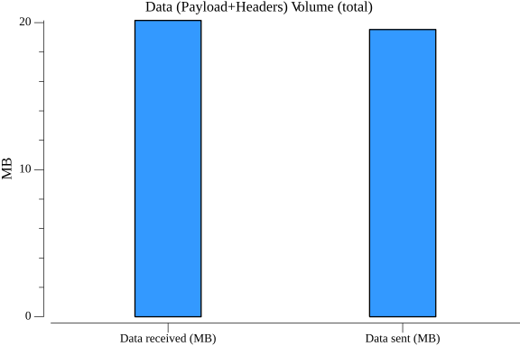
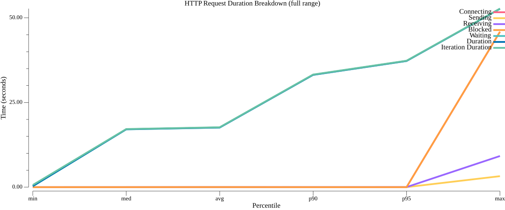
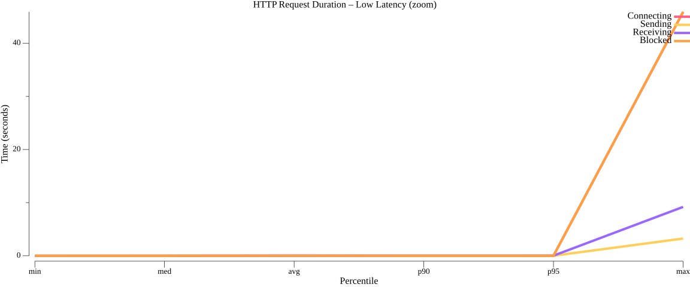
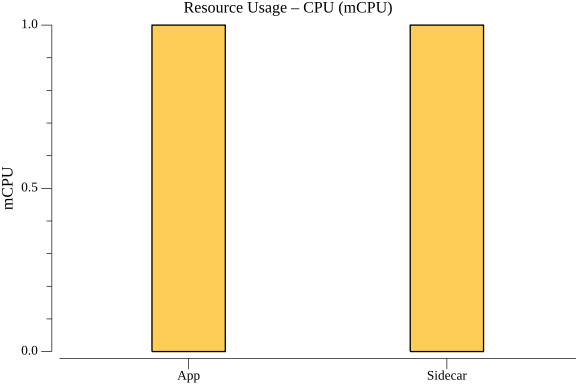
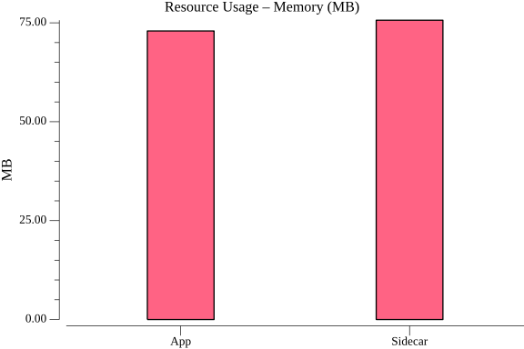
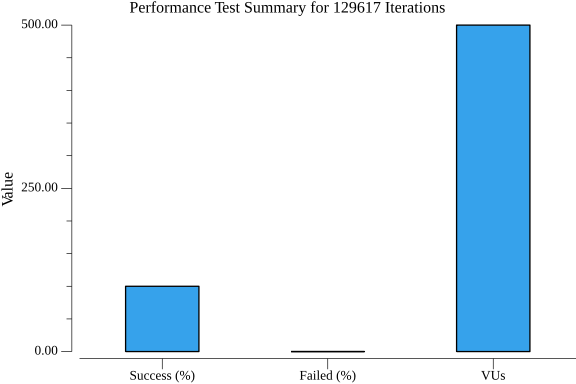
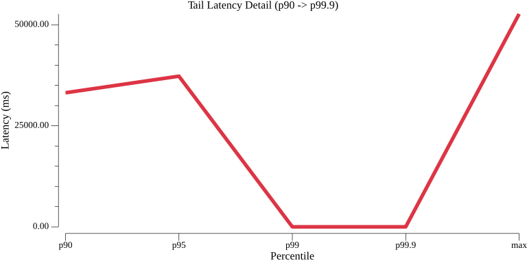
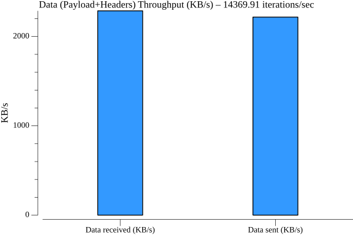

### TestConfigurationSubscribeGRPCPerformance

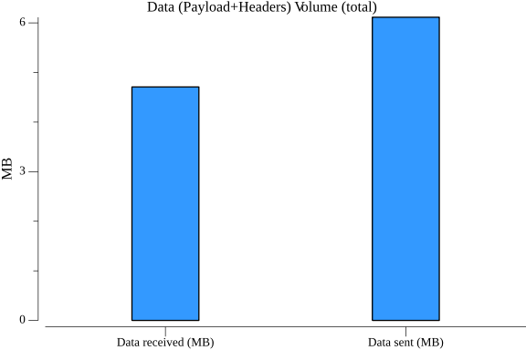
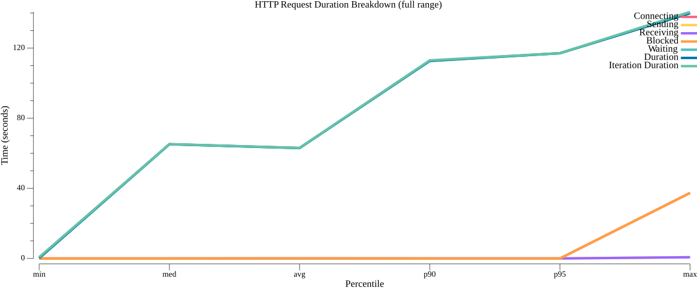
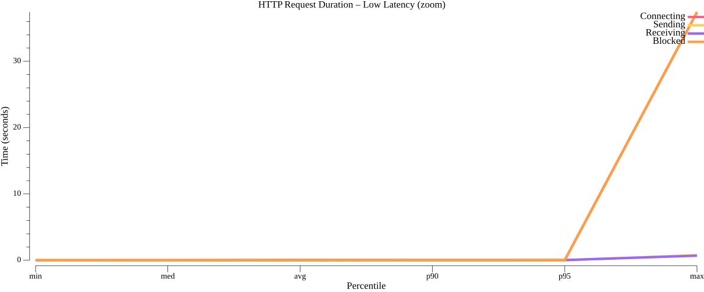

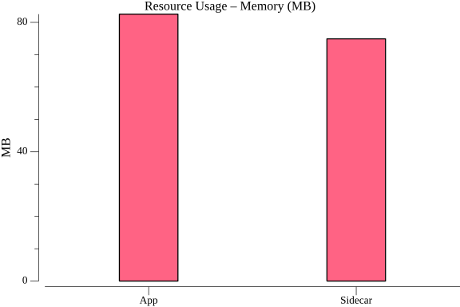

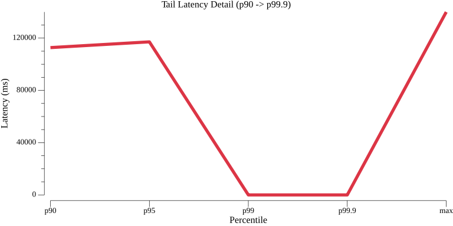
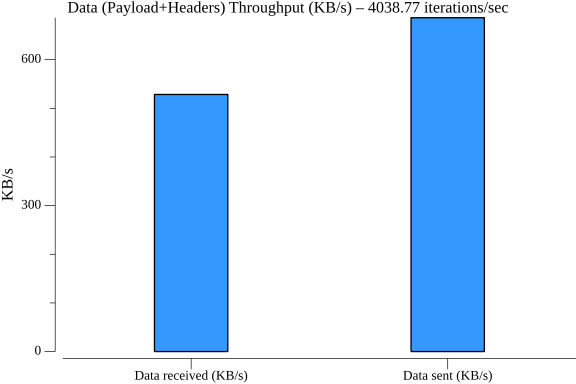
