**Test environment:** Azure AKS, 3x Standard_D2s_v6 (2 vCPU, 8 GiB) Linux nodes

### Throughput per resource

Iterations/sec relative to the CPU and memory consumed by the app and its Dapr sidecar combined.
Resource figures are point-in-time samples taken at the end of each run: memory is steady-state and comparable across runs, but treat the per-core column as indicative only until resource usage is sampled continuously during the run.

| Test | Iterations/sec | App CPU (m) | App Mem (MB) | Sidecar CPU (m) | Sidecar Mem (MB) | Iter/s per core | Iter/s per GB |
| --- | --- | --- | --- | --- | --- | --- | --- |
| TestBulkPubsubPublishGrpcPerformance_In-memory_with_with_cloud_event | 199.94 | 476 | 41 | 1126 | 77 | 124.8 | 1726.1 |
| TestBulkPubsubPublishGrpcPerformance_In-memory_without_cloud_event_(raw_payload) | 199.95 | 372 | 44 | 1000 | 76 | 145.7 | 1701.8 |
| TestBulkPubsubPublishGrpcPerformance_Kafka_with_cloud_event | 199.94 | 564 | 42 | 1676 | 94 | 89.3 | 1497.7 |
| TestBulkPubsubPublishGrpcPerformance_Kafka_without_cloud_event_(raw_payload) | 199.94 | 758 | 43 | 1545 | 94 | 86.8 | 1493.1 |

### TestBulkPubsubPublishGrpcPerformance_In-memory_with_with_cloud_event

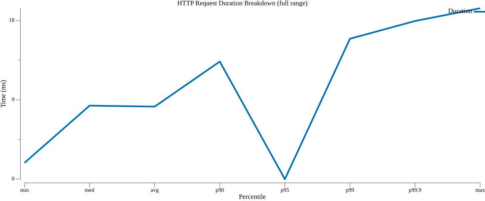
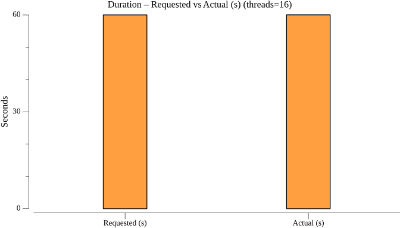
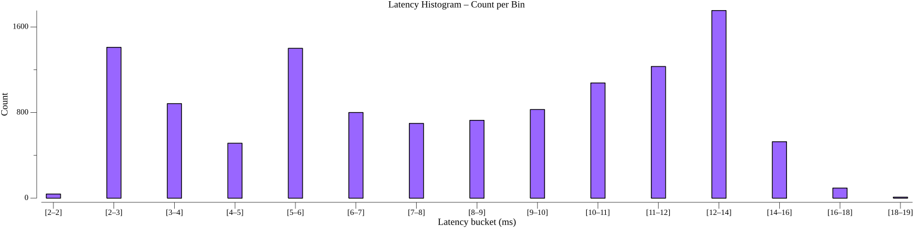
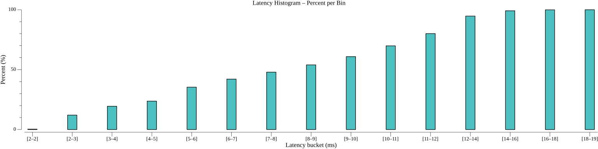

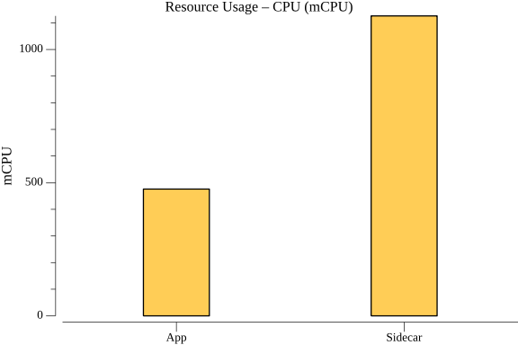
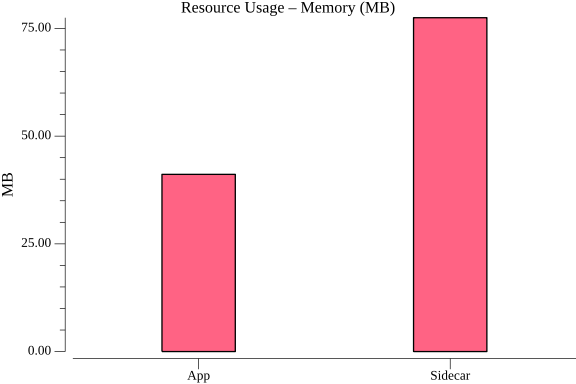

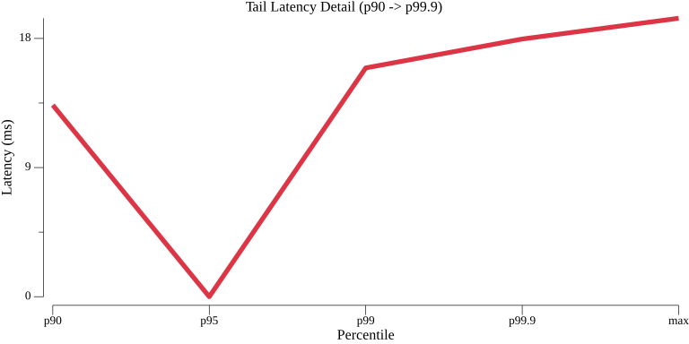

### TestBulkPubsubPublishGrpcPerformance_In-memory_without_cloud_event_(raw_payload)

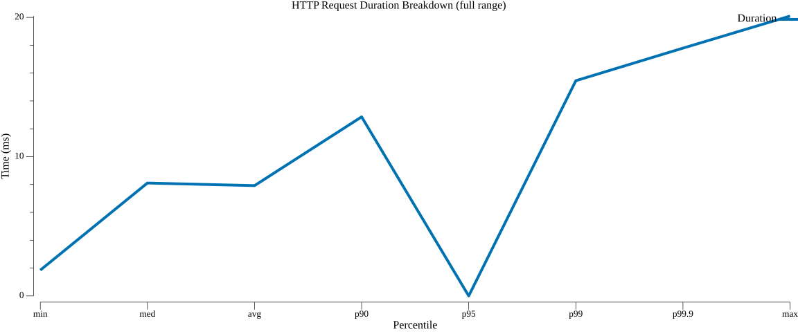

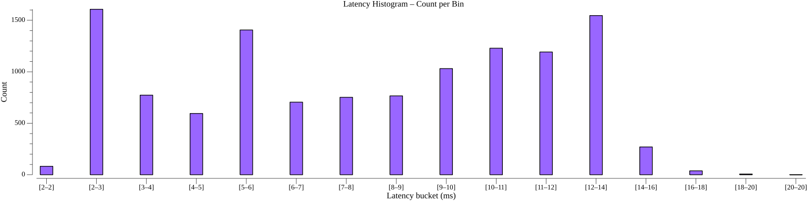
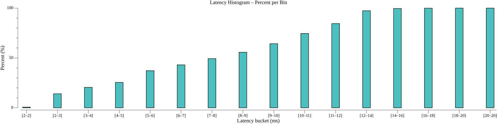
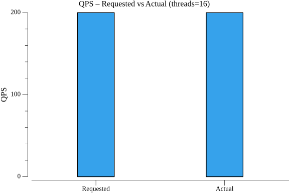
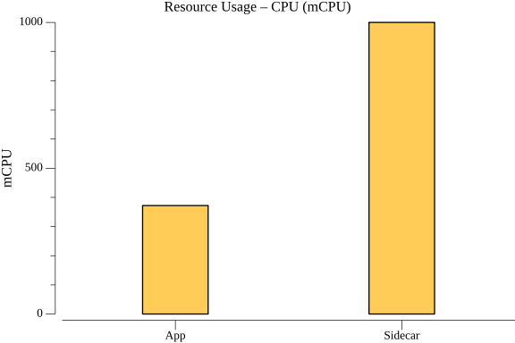
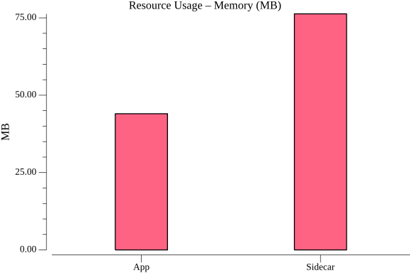

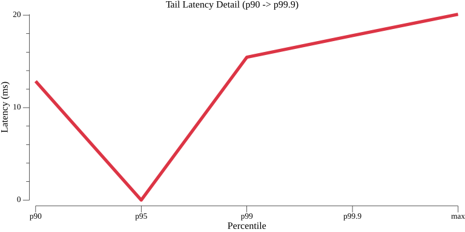

### TestBulkPubsubPublishGrpcPerformance_Kafka_with_cloud_event

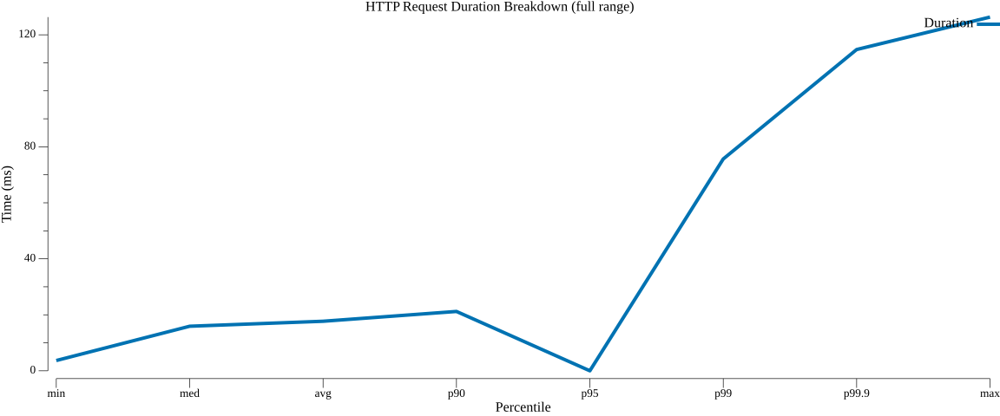

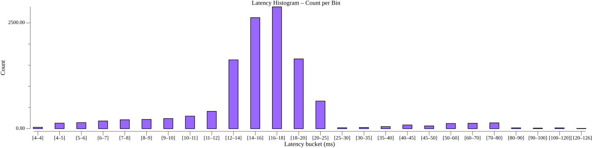
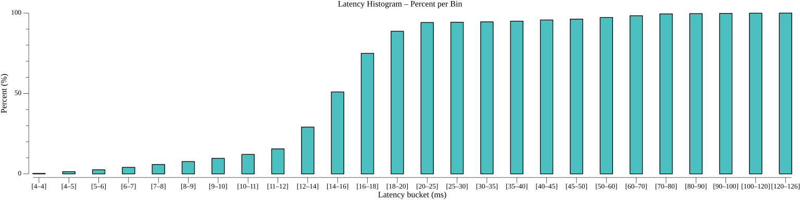

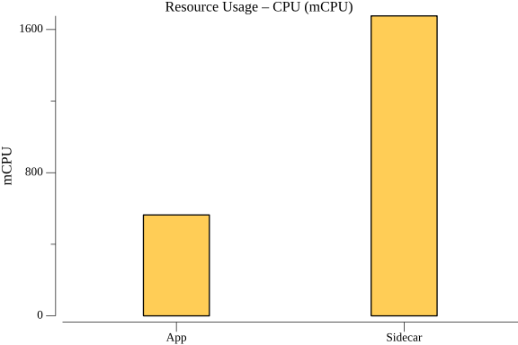
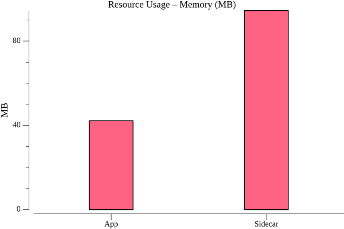
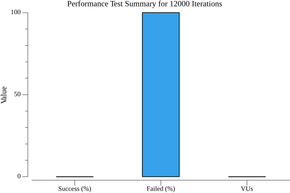
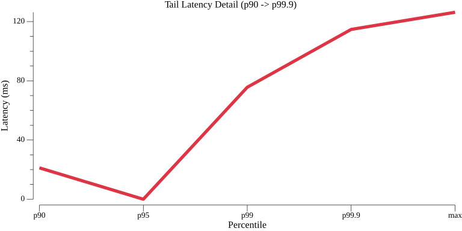

### TestBulkPubsubPublishGrpcPerformance_Kafka_without_cloud_event_(raw_payload)

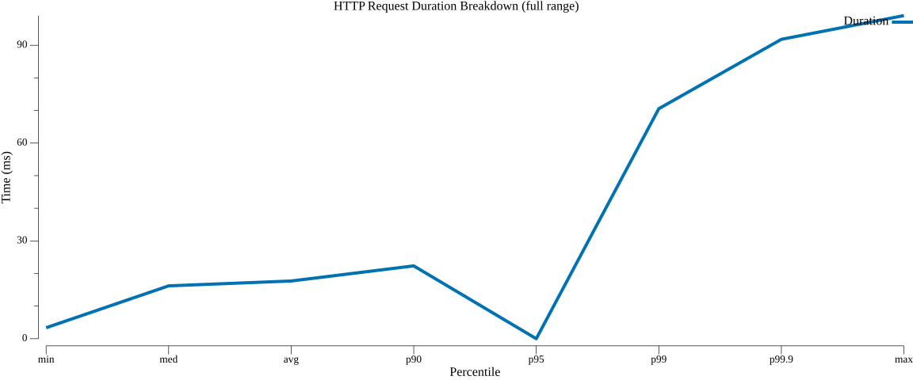

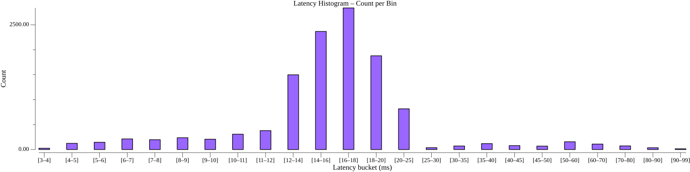
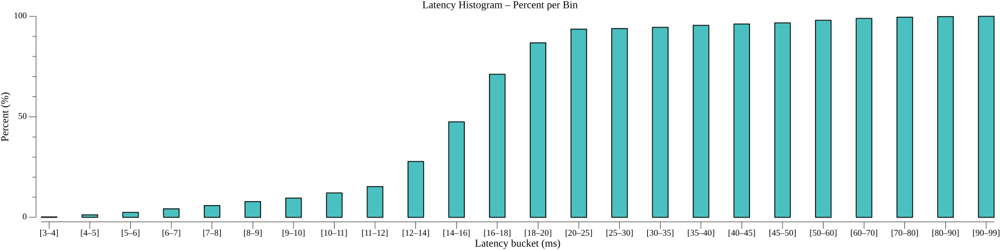

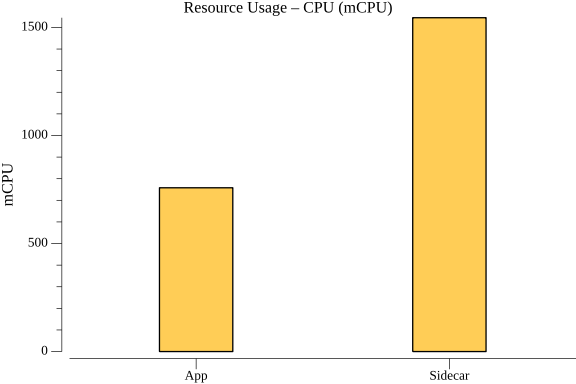
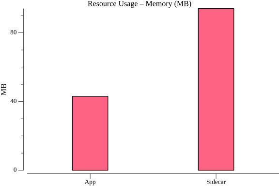

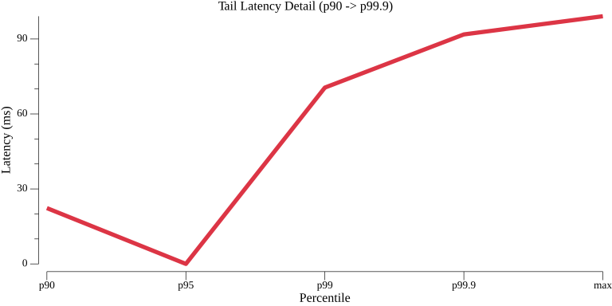

### TestBulkPubsubPublishGrpcPerformance_variants_duration

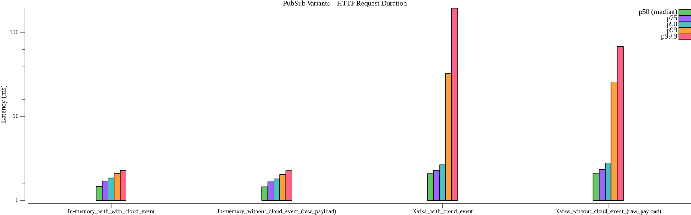
